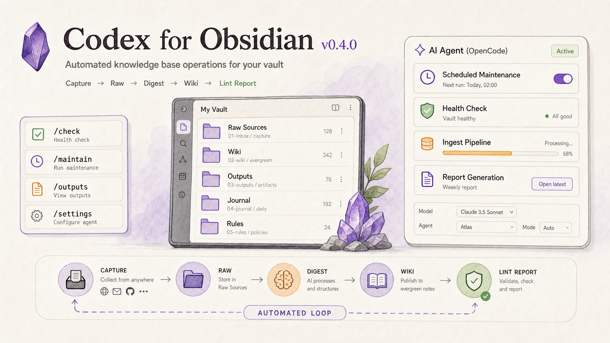
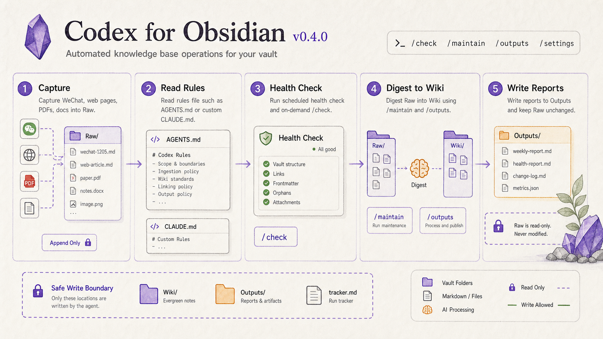

<a href="https://github.com/AKin-lvyifang/obsidian-codex">
  
</a>

<p align="center">
  <a href="#features">Features</a> ·
  <a href="#whats-new">What's New</a> ·
  <a href="#install">Install</a> ·
  <a href="#quick-start">Quick Start</a> ·
  <a href="#screenshots">Screenshots</a> ·
  <a href="#development">Development</a> ·
  <a href="#license">License</a> ·
  <a href="README_CN.md">中文</a>
</p>

<p align="center">
  <a href="https://github.com/AKin-lvyifang/obsidian-codex/releases/latest">
    
    
    
    
  </a>
</p>

<p align="center">
  <a href="https://github.com/AKin-lvyifang/obsidian-codex/releases/download/v0.4.0/obsidian-codex-0.4.0.zip"><strong>Download v0.4.0</strong></a>
  ·
  <a href="https://github.com/AKin-lvyifang/obsidian-codex/releases/latest">Latest Release</a>
</p>

---

## Features

### Vault-native Codex Workspace

- Opens Codex in the Obsidian sidebar.
- Uses the current vault as the working directory.
- Lets Codex read notes, inspect folders, edit documents, and run local commands.
- Keeps the workflow inside Obsidian instead of bouncing between apps.

### Agent-style Process Timeline

- Renders reasoning, commands, file edits, MCP calls, and context usage as readable process cards.
- Shows file chips for touched files, with vault files opening back in Obsidian.
- Keeps large outputs and raw details folded away so the conversation stays readable.
- Supports Agent / Plan mode, model selection, reasoning effort, speed, and file permission modes.

### Knowledge Base Operations

- Adds a persistent `Knowledge` channel for maintaining the current Obsidian vault.
- Treats chat as the main control surface: type `/init`, `/check`, `/maintain`, `/outputs`, `/journal`, or `/inbox`, then add your own instruction after the command.
- Adds an LLM Wiki initialization guide: `/init` previews folders, rules files, and existing-note routing suggestions; `/init confirm` creates the template.
- Shows a pinned Knowledge health dashboard above the channel: rules file, Raw/Wiki/Inbox counts, health status, detailed Wiki folder table, Raw/Inbox table, and a 14-day check heatmap.
- Reads `AGENTS.md` by default, or a custom Markdown rules file such as `CLAUDE.md` when configured.
- Collects WeChat articles, web pages, and text files into Raw Sources before processing.
- Keeps existing Raw files unchanged, then writes structured results to Wiki, Outputs, Journal, and tracker files.
- Supports manual runs and daily maintenance when Obsidian is open.

### Local-first Integration

- Reuses your local Codex CLI login state.
- Does not require storing an OpenAI API key by default.
- Optionally supports OpenAI Responses API-compatible custom providers, including multiple models per provider.
- Supports local proxy settings for the Codex child process.
- Keeps plugin, MCP, and skill switches scoped to the current vault instead of rewriting global Codex config.

### OpenCode API Mode

- Keeps the original Codex CLI mode for users who want to reuse local Codex login state.
- Adds OpenCode API mode for knowledge base tasks when OpenCode is installed locally.
- Can detect or connect to an OpenCode server, refresh available models, and choose the active OpenCode model.
- Can refresh and choose OpenCode Agents, so different knowledge management workflows can use different agent profiles.

### Writing Context Harness

- Adds in-editor rewrite, expand, continue, and translate-to-English actions for selected text.
- Lets you choose `Fast`, `Quality`, or `Strict` writing quality modes.
- Uses visible article understanding for long-form context instead of silently running background summaries.
- Shows a writing context panel with the current note, model, understanding status, and structured article understanding.
- Reuses article understanding after small edits, so continuous rewrite / expand / continue / translate runs do not repeatedly re-read the whole note.
- Shows an inline candidate that can be accepted with `Enter` or canceled with `Esc`.

This feature is still experimental and disabled by default, but v0.3.0 makes it a much more deliberate writing workflow.

## What's New

### v0.4.0

**New feature:** Knowledge Base Operations for automated Obsidian vault maintenance.

**What changed:**

- Added a persistent knowledge base channel bound to the current vault.
- Added command templates: `/check`, `/maintain`, `/outputs`, `/journal`, and `/inbox`.
- Added WeChat, web page, and file capture entry points for Raw Sources.
- Added configurable knowledge base rules file. `AGENTS.md` is the default; a custom Markdown file can replace it.
- Added OpenCode model selection and OpenCode Agent selection for OpenCode API mode.
- Added selected-text translation to English from the editor context menu.
- Improved the knowledge base settings page alignment, status copy, and rules-file picker.
- Kept the safety boundary: existing Raw files are not rewritten, deleted, or archived automatically.

**How to use:**

1. Open the `Knowledge` channel in the Codex sidebar.
2. In settings, choose `Codex CLI` or `OpenCode API` as the knowledge base backend.
3. For OpenCode mode, install OpenCode locally, then refresh and select a model and Agent.
4. For a new vault, type `/init` to preview the LLM Wiki setup; type `/init confirm` only after reviewing it.
5. Use the pinned health dashboard to check rules, Raw/Wiki/Inbox counts, risk reasons, folder updates, and recent `/check` history.
6. Type `/check broken links`, `/maintain new raw sources`, or `/outputs weekly notes` in the knowledge channel.
7. Use the capture shortcuts to collect WeChat articles, web pages, or files into Raw Sources.

### v0.3.0

**New feature:** Writing Context Harness for editor rewrite, expand, and continue.

**What changed:**

- Added `Fast`, `Quality`, and `Strict` writing quality modes.
- Added visible article understanding in the sidebar writing context panel.
- Added structured article understanding for theme, audience, purpose, structure, facts, style, fabrication boundaries, and local writing guidance.
- Added soft reuse for article understanding, so small continuous edits reuse existing understanding instead of re-running it every time.
- Added strict-mode review, which checks the generated candidate before showing it.
- Kept the inline candidate flow: `Enter` accepts, `Esc` cancels.
- Kept article understanding out of the normal chat history.

**How to use:**

1. Enable writing actions in the plugin settings.
2. Choose the default writing quality mode: `Fast`, `Quality`, or `Strict`.
3. Select text in the editor and run `Rewrite`, `Expand`, or `Continue`.
4. Click the `Writing` chip in the sidebar to inspect or refresh article understanding.
5. Press `Enter` to accept the gray candidate, or `Esc` to cancel.

### v0.2.0

**Bug fix:** fixed `spawn codex ENOENT` after Codex account re-login by detecting the Codex Desktop CLI path and adding a manual login refresh button.

**Experimental feature:** rewrite, expand, and continue selected editor text in place. This is still experimental, disabled by default, and not recommended for stable daily use.

**How to test:**

1. Enable writing actions in the plugin settings.
2. Select text in the editor and right-click `Rewrite`, `Expand`, or `Continue`.
3. Press `Enter` to accept the gray candidate, or `Esc` to cancel.
4. Test on non-critical notes first.

### v0.1.2

**New feature:** public releases now keep the GitHub repository focused on install and usage files only.

**How to use:**

1. Download the latest release package.
2. Install the `obsidian-codex` plugin folder.
3. Use the plugin without browsing internal project documents.

### v0.1.1

**New feature:** paste WeChat or system screenshots directly into the Codex input box.

**How to use:**

1. Take a screenshot.
2. Click the Codex input box.
3. Press `Command+V`, then send.

## Install

1. Install and log in to Codex CLI for Codex CLI mode.
2. Optionally install OpenCode if you want to use OpenCode API mode for knowledge base management.
3. Download [`obsidian-codex-0.4.0.zip`](https://github.com/AKin-lvyifang/obsidian-codex/releases/download/v0.4.0/obsidian-codex-0.4.0.zip) from [the latest release](https://github.com/AKin-lvyifang/obsidian-codex/releases/latest).
4. Unzip it and get the `obsidian-codex` folder.
5. Move it into your vault plugin directory:

```text
<vault>/.obsidian/plugins/obsidian-codex/
```

6. Restart Obsidian and enable `Codex for Obsidian` in Community plugins.

The plugin folder should contain:

```text
obsidian-codex/
  main.js
  manifest.json
  styles.css
```

## Quick Start

1. Open the Codex sidebar from the ribbon icon or command palette.
2. Ask Codex to inspect, summarize, rewrite, or manage files in the current vault.
3. Attach notes, files, images, skills, or MCP tools when needed.
4. Review the process cards for commands, edits, context usage, and evidence.
5. Open the `Knowledge` channel when you want Codex to operate your vault knowledge base.
6. For a new vault, start with `/init`; for an existing structured vault, start with `/check`, then use `/maintain` or `/outputs` when you want it to write structured knowledge.

## Screenshots




## Development

```bash
npm install
npm run test
npm run typecheck
npm run build
```

Generate a shareable install package:

```bash
npm run package
```

Deploy to your own Obsidian vault:

```bash
OBSIDIAN_VAULT=/path/to/your/vault npm run deploy
```

## Requirements

- Codex CLI must be installed and available locally for Codex CLI mode.
- OpenCode must be installed locally for OpenCode API mode. The plugin can connect to or start the OpenCode server, but it does not silently install OpenCode.
- Custom API providers for Codex CLI mode must be compatible with the OpenAI Responses API, such as `/v1/responses`. Providers that only support `/v1/chat/completions` may not work.
- Custom API keys are stored in Obsidian plugin data, so use them only on a trusted local machine.
- Leave the Codex CLI path empty to auto-detect it from `PATH` and common install folders, or set the path manually in plugin settings.

## License

Codex for Obsidian is open source under the [MIT License](LICENSE).

You may use, copy, modify, merge, publish, distribute, sublicense, and sell copies of this software as permitted by the MIT License, as long as the copyright and license notice are included. The software is provided "as is", without warranty of any kind.
