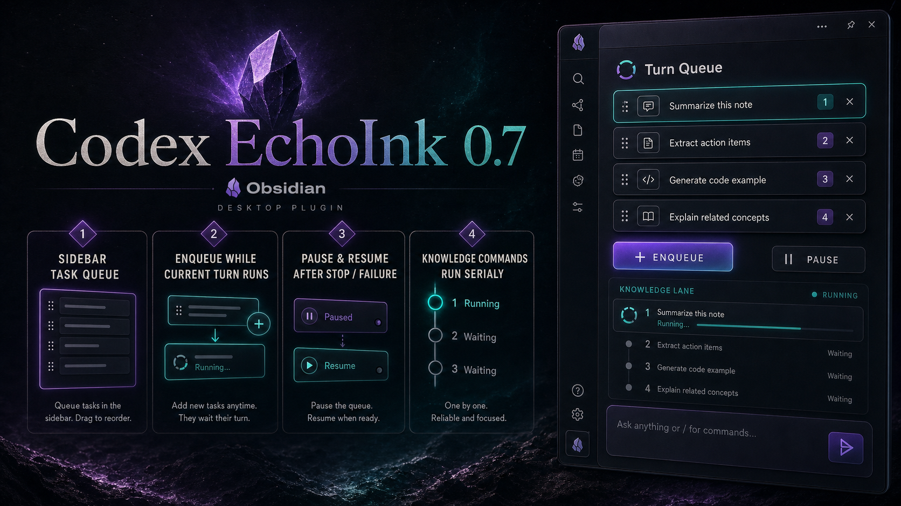
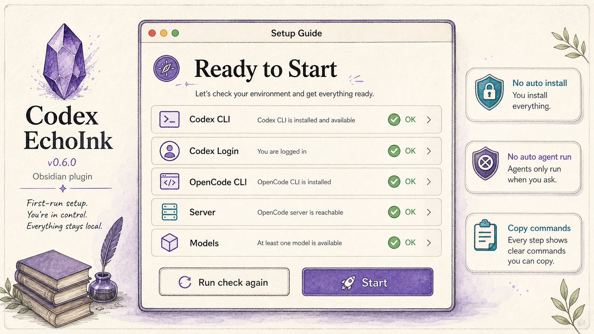
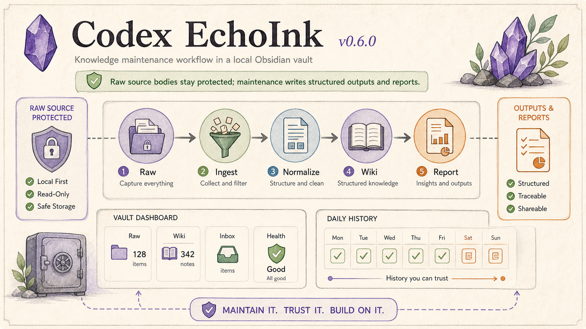
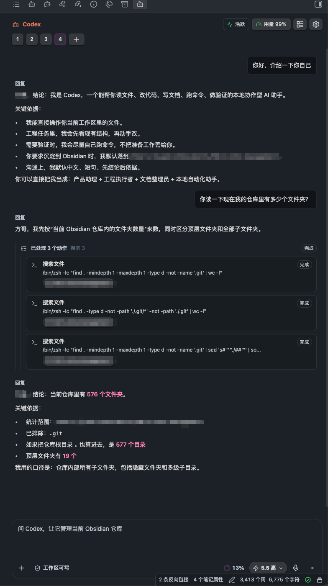

<a href="https://github.com/AKin-lvyifang/codex-echoink">
  
</a>

<h1 align="center">Codex EchoInk</h1>

<p align="center">
  <a href="#features">Features</a> ·
  <a href="#why-echoink">Why EchoInk</a> ·
  <a href="#whats-new">What's New</a> ·
  <a href="#install">Install</a> ·
  <a href="#quick-start">Quick Start</a> ·
  <a href="#privacy-and-permissions">Privacy</a> ·
  <a href="#screenshots">Screenshots</a> ·
  <a href="#development">Development</a> ·
  <a href="#license">License</a> ·
  <a href="README_CN.md">中文</a>
</p>

<p align="center">
  <a href="https://github.com/AKin-lvyifang/codex-echoink/releases/latest">
    
    
    
    
  </a>
</p>

<p align="center">
  <a href="https://github.com/AKin-lvyifang/codex-echoink/releases/download/0.7.1/codex-echoink-0.7.1.zip"><strong>Download v0.7.1</strong></a>
  ·
  <a href="https://github.com/AKin-lvyifang/codex-echoink/releases/latest">Latest Release</a>
</p>

---

## Features

### First-run Setup Guide



- Checks Codex CLI, Codex login, OpenCode CLI, OpenCode server, models, and Agent readiness before the user starts.
- Shows missing requirements first, with install commands, copy buttons, and documentation links.
- Lets users click `Run check again` after installing or logging in, then shows `Start` only when blocking checks are clear.
- `Start` opens the EchoInk sidebar and records setup completion; it does not send a message or run a Knowledge task.
- Keeps setup explicit: no silent installs, no surprise background Agent work.

### Session-scoped Codex Workspace

- Opens Codex in the Obsidian sidebar.
- Requires a folder picker for ordinary chat sessions before sending.
- Treats attached notes as turn context only; attaching a note does not make the whole vault the workspace.
- Keeps the `Knowledge` channel bound to the current vault for Raw, Wiki, Outputs, and Inbox maintenance.
- Lets Codex read files, inspect folders, edit documents, and run local commands.
- Keeps the workflow inside Obsidian instead of bouncing between apps.

### Agent-style Process Timeline

- Renders reasoning, commands, file edits, MCP calls, and context usage as readable process cards.
- Shows file chips for touched files, with vault files opening back in Obsidian.
- Keeps large outputs and raw details folded away so the conversation stays readable.
- Supports Agent / Plan mode, model selection, reasoning effort, speed, and file permission modes.

### Turn Queue


- Queue follow-up tasks while the current Agent turn is still running.
- Keeps queues scoped to each session, so ordinary chat and Knowledge channel work do not mix.
- Captures the exact text, attachments, Skill, model, permissions, mode, and workspace at enqueue time.
- Shows queued cards above the composer, with delete and drag-to-reorder for work that has not started.
- Runs the next item only after the current task succeeds; stop or failure pauses the queue until you resume it.
- Keeps Knowledge commands such as `/ask`, `/maintain`, and `/journal` serial, so they do not run on top of each other.

### Knowledge Base Operations



- Adds a persistent `Knowledge` channel for maintaining the current Obsidian vault.
- Treats chat as the main control surface: type `/init`, `/ask`, `/check`, `/maintain`, `/outputs`, `/journal`, or `/inbox`, then add your own instruction after the command.
- Adds an LLM Wiki initialization guide: `/init` previews folders, rules files, and existing-note routing suggestions; `/init confirm` creates the template.
- Answers read-only knowledge questions with `/ask`, searching Wiki first and then using Journal / Outputs as background evidence, while separating Vault evidence from external or model-based supplements.
- Writes daily journals with `/journal`, following the current `journal/` folder layout and recent note format; the workday window is `00:00` through before next-day `06:00`, with Codex CLI reading Codex sessions and OpenCode API reading OpenCode chat history.
- Keeps only the latest active Knowledge day in the channel; older chat history is stored by day under the plugin `history/` data folder and browsed through `/history`.
- Shows Codex CLI knowledge-base runs with the same process cards as regular Agent chats: reasoning, commands, file changes, tool calls, and final results.
- Shows a pinned Knowledge health dashboard above the channel: rules file, Raw/Wiki/Inbox counts, health status, detailed Wiki folder table, Raw/Inbox table, and a full-year check heatmap.
- Reads `LLM-WIKI.md` as the knowledge-base rules source by default; `AGENTS.md` remains runtime background for Codex/OpenCode.
- Optionally recommends [`codex-memory-lite`](https://github.com/AKin-lvyifang/codex-memory-lite) for longer-lived knowledge context; your Agent installs the skill and runs its bootstrap in the workspace, while the plugin does not bundle the skill or modify your `AGENTS.md`.
- Collects WeChat articles, web pages, and text files into Raw Sources before processing.
- Keeps existing Raw files unchanged, then writes structured results to Wiki, Outputs, Journal, and tracker files.
- Runs `/maintain` as an ingest, structure-normalize, and lint workflow, with plugin-side checks protecting Raw source bodies.
- Supports manual runs and daily maintenance when Obsidian is open.

### Weekly Reviews

- Adds a `Review` settings tab, with scheduled automation disabled by default.
- Lets you enable `Knowledge` and `Agent chat` weekly reviews separately.
- Runs by default every Sunday at 21:00, with catch-up the next time Obsidian opens.
- Writes Markdown and matching HTML files to `outputs/obsidian-weekly-review/`.
- Uses a fixed HTML dashboard template and opens it through EchoInk's built-in preview.

### Local-first Integration

- Reuses your local Codex CLI login state.
- Does not require storing an OpenAI API key by default.
- Optionally supports OpenAI Responses API-compatible custom providers, including multiple models per provider.
- Supports local proxy settings for the Codex child process.
- Keeps plugin, MCP, and skill switches scoped to the current vault instead of rewriting global Codex config.
- Adds search to the current-vault plugin, MCP, and skill switches, with long labels clipped cleanly so the enable checkbox stays reachable.

### OpenCode API Mode

- Keeps the original Codex CLI mode for users who want to reuse local Codex login state.
- Adds OpenCode API mode for knowledge base tasks when OpenCode is installed locally.
- Can detect or connect to an OpenCode server, refresh available models, and choose the active OpenCode model.
- Can refresh and choose OpenCode Agents, so different knowledge management workflows can use different agent profiles.

### Writing Context Harness

- Adds in-editor rewrite, expand, continue, and translate-to-English actions for selected text.
- Lets you choose `Fast`, `Quality`, or `Strict` writing quality modes.
- Uses visible article understanding for long-form context instead of silently running background summaries.
- Shows a writing context panel with the current note, model, understanding status, and structured article understanding.
- Reuses article understanding after small edits, so continuous rewrite / expand / continue / translate runs do not repeatedly re-read the whole note.
- Shows an inline candidate that can be accepted with `Enter` or canceled with `Esc`.

This feature is still experimental and disabled by default, but v0.3.0 makes it a much more deliberate writing workflow.

## Why EchoInk

Codex EchoInk turns ink into a codex, then lets it echo back as new ideas.

- `Ink` is the record: notes, clippings, drafts, sources, and conversations.
- `Codex` is the knowledge base: structured wiki pages, indexes, reports, and traceable source links.
- `Echo` is the activation layer: vault-aware questions, maintenance runs, writing help, and future inspiration workflows.

The name matches the Obsidian loop: record, organize, and get prompted into the next thought.

## What's New

### v0.7.1

**Stability update:** Turn Queue now handles success, failure, stop, and Knowledge task concurrency more predictably.

**What changed:**

- Successful tasks continue the queue only when another item is waiting.
- Failed or stopped tasks pause the queue and keep remaining work for manual resume.
- Queued turns no longer start while an ordinary turn, Knowledge task, or queue startup is already in progress.
- Dragging queue cards stays inside the queue UI instead of leaking into the composer attachment drop area.

### v0.7.0

**New feature:** Turn Queue for ordinary chat and Knowledge channel tasks.

**What changed:**

- Added a session-scoped queue above the composer.
- While a task is running, a non-empty composer changes the primary button to `Enqueue`.
- With an empty composer, the same button still stops the current task.
- Queue items capture text, attachments, selected Skill, model, permission, mode, and workspace at enqueue time.
- Successful tasks advance to the next queued item automatically.
- Failed or stopped tasks pause the queue and keep the remaining items for manual resume.
- Knowledge commands such as `/ask`, `/maintain`, and `/journal` now run serially through the queue.

**How to use:**

1. Start a chat or Knowledge command.
2. Type the next task while the current one is running.
3. Click `Enqueue`.
4. Reorder or delete waiting items above the composer.
5. If a task is stopped or fails, click `Resume queue` when you are ready.

### v0.6.0

**Setup guide and knowledge maintenance update:** adds a first-run environment guide, safer rechecks, a clear `Start` step, and stronger Knowledge maintenance boundaries.

**New features:**

- Added a first-run setup guide in settings for Codex CLI, Codex login, OpenCode CLI, OpenCode server, models, and Agent readiness.
- Added install commands, copy buttons, and documentation links when a required runtime is missing.
- Added `Run check again` to re-detect CLI paths, refresh Codex login, and reconnect or start OpenCode when needed.
- Added `Start` as an explicit setup completion step. It opens the EchoInk sidebar without sending a message or running a Knowledge task.

**Fixes and maintenance:**

- Added Windows path detection for Codex CLI and OpenCode CLI.
- Upgraded Knowledge history to day-based archive storage with settings tools for indexing, export, and compaction.
- Tightened Knowledge maintenance so Agent tasks cannot directly rewrite Raw source bodies; raw path normalization is handled by plugin-side checks.
- Improved Knowledge maintenance reports, dashboard state, local note links, and history entry placement.

### v0.5.2

**Knowledge workflow and Windows diagnostics update:** adds weekly review reports, improves `/journal`, makes Knowledge runs easier to inspect, and fixes the bad `gpt-5.5` default that could trigger Windows WebSocket failures.

**New features:**

- Added Knowledge and Agent chat weekly reviews, with scheduled or manual runs and Markdown + HTML output in `outputs/obsidian-weekly-review/`.
- Added an EchoInk HTML preview for generated weekly review reports.
- Added `/week` and `/week agent` shortcuts in the Knowledge channel.
- Upgraded `/journal` to write into the current `journal/daily/YYYY-MM/YYYY-MM-DD-周X.md` layout, create missing journal folders, and use a fixed `00:00` to next-day `06:00` work window.
- Added OpenCode chat-history collection for `/journal` when the Knowledge backend uses OpenCode API.
- Expanded `/ask` evidence from `wiki/` to `wiki/`, `journal/`, and `outputs/`, with citation buckets, excerpt lines, relevance, and match reasons.
- Added a settings language switch for Chinese / English settings UI.

**Fixes:**

- Changed the Codex CLI default model to `Auto`; existing saved `gpt-5.5` defaults are migrated to `Auto`.
- Removed remaining hard-coded `gpt-5.5` fallback paths from Knowledge tasks and Plan mode.
- Added detailed Codex diagnostics for WebSocket, proxy refusal, missing CLI, timeout, and app-server exit errors.
- Added Windows `responses_websocket` / `os error 10061` troubleshooting guidance.
- Simplified Review settings so manual report generation has confirmation and clearer output paths.
- Shows Codex CLI Knowledge runs through the normal process timeline, so reasoning, commands, file edits, and final results stay in one visible flow.
- In the Knowledge channel, ordinary messages now stay as normal Agent chat. Only explicit `/ask`, `/query`, `/问`, or `/查询` commands trigger Knowledge Q&A.
- The Knowledge channel primary button now stops ordinary Agent chat when that chat is running, instead of canceling Knowledge maintenance by mistake.
- Knowledge failures now keep more complete app-server, JSON-RPC, OpenCode, and turn error details for easier troubleshooting.
- Local vault note paths and report paths in Knowledge replies render as clickable note links.

### v0.5.1

**Community review fix:** removed the redundant word `Obsidian` from `manifest.json` description and dropped the legacy `main` manifest field to satisfy automated community checks.

### v0.5.0

**Community-ready release:** renamed the plugin to `Codex EchoInk`, prepared the `codex-echoink` community plugin id, and added clearer privacy and permission disclosures for Obsidian review.

**What changed:**

- Renamed the plugin from `Codex for Obsidian` / `obsidian-codex` to `Codex EchoInk` / `codex-echoink`.
- Updated install paths, release links, packaging output, and visible repository references for the new community name.
- Kept compatibility with large raw message files stored by older manual installs under `.obsidian/plugins/obsidian-codex/raw`.
- Added privacy and permission notes covering Codex CLI, OpenCode, model providers, local API keys, and vault write boundaries.
- Prepared release assets for community installation: `main.js`, `manifest.json`, `styles.css`, and `codex-echoink-0.5.0.zip`.

### v0.4.1

**New feature:** Knowledge channel refinements for querying, visibility, and day-to-day control.

**What changed:**

- Added `/ask` for read-only knowledge questions. It searches `wiki/` first, sends the most relevant notes as context, and asks the Agent to distinguish Vault evidence from supplemental information.
- Kept read-only Knowledge Q&A behind explicit `/ask`; ordinary natural-language messages stay as normal Agent chat in current behavior.
- Upgraded the Knowledge health heatmap from a short recent strip to a full-year GitHub-style view with month labels, weekday labels, success states, and failed checks.
- Added Codex CLI model and reasoning-effort controls directly in the Knowledge channel composer. The Knowledge task no longer has to use a hard-coded reasoning level.
- Added search boxes to the current-vault `Plugins`, `MCP`, and `Skills` capability tabs. Search covers name, id/path, metadata, and description, and multiple words work as an AND filter.
- Fixed long capability rows by clipping names, paths, and descriptions with ellipses, so the right-side checkbox remains visible and clickable.
- Kept `LLM-WIKI.md` as the default knowledge rules file, with `AGENTS.md` preserved as a compatibility option and runtime background.

**How to use:**

1. Open the `Knowledge` channel.
2. Type `/ask your question` when you want the Knowledge channel to search vault sources.
3. Use the bottom model button in Codex CLI mode to choose the model and reasoning effort for Knowledge tasks.
4. Expand the health dashboard to review the full-year check heatmap.
5. Open plugin settings, go to current-vault capability management, then search within `Plugins`, `MCP`, or `Skills` before toggling items.

### v0.4.0

**New feature:** Knowledge Base Operations for automated Obsidian vault maintenance.

**What changed:**

- Added a persistent knowledge base channel bound to the current vault.
- Added command templates: `/check`, `/maintain`, `/outputs`, `/journal`, and `/inbox`.
- Added WeChat, web page, and file capture entry points for Raw Sources.
- Added configurable knowledge base rules file. `LLM-WIKI.md` is the default; a custom Markdown file can replace it.
- Added an optional `codex-memory-lite` recommendation in settings for users who want long-term memory across knowledge-base runs.
- Added OpenCode model selection and OpenCode Agent selection for OpenCode API mode.
- Added selected-text translation to English from the editor context menu.
- Improved the knowledge base settings page alignment, status copy, and rules-file picker.
- Kept the safety boundary: existing Raw files are not rewritten, deleted, or archived automatically.

**How to use:**

1. Open the `Knowledge` channel in the Codex sidebar.
2. In settings, choose `Codex CLI` or `OpenCode API` as the knowledge base backend.
3. For OpenCode mode, install OpenCode locally, then refresh and select a model and Agent.
4. For a new vault, type `/init` to preview the LLM Wiki setup; type `/init confirm` only after reviewing it.
5. Use the pinned health dashboard to check rules, Raw/Wiki/Inbox counts, risk reasons, folder updates, and recent `/check` history.
6. Type `/check broken links`, `/maintain new raw sources`, or `/outputs weekly notes` in the knowledge channel.
7. Use the capture shortcuts to collect WeChat articles, web pages, or files into Raw Sources.

### v0.3.0

**New feature:** Writing Context Harness for editor rewrite, expand, and continue.

**What changed:**

- Added `Fast`, `Quality`, and `Strict` writing quality modes.
- Added visible article understanding in the sidebar writing context panel.
- Added structured article understanding for theme, audience, purpose, structure, facts, style, fabrication boundaries, and local writing guidance.
- Added soft reuse for article understanding, so small continuous edits reuse existing understanding instead of re-running it every time.
- Added strict-mode review, which checks the generated candidate before showing it.
- Kept the inline candidate flow: `Enter` accepts, `Esc` cancels.
- Kept article understanding out of the normal chat history.

**How to use:**

1. Enable writing actions in the plugin settings.
2. Choose the default writing quality mode: `Fast`, `Quality`, or `Strict`.
3. Select text in the editor and run `Rewrite`, `Expand`, or `Continue`.
4. Click the `Writing` chip in the sidebar to inspect or refresh article understanding.
5. Press `Enter` to accept the gray candidate, or `Esc` to cancel.

### v0.2.0

**Bug fix:** fixed `spawn codex ENOENT` after Codex account re-login by detecting the Codex Desktop CLI path and adding a manual login refresh button.

**Experimental feature:** rewrite, expand, and continue selected editor text in place. This is still experimental, disabled by default, and not recommended for stable daily use.

**How to test:**

1. Enable writing actions in the plugin settings.
2. Select text in the editor and right-click `Rewrite`, `Expand`, or `Continue`.
3. Press `Enter` to accept the gray candidate, or `Esc` to cancel.
4. Test on non-critical notes first.

### v0.1.2

**New feature:** public releases now keep the GitHub repository focused on install and usage files only.

**How to use:**

1. Download the latest release package.
2. Install the `codex-echoink` plugin folder.
3. Use the plugin without browsing internal project documents.

### v0.1.1

**New feature:** paste WeChat or system screenshots directly into the Codex input box.

**How to use:**

1. Take a screenshot.
2. Click the Codex input box.
3. Press `Command+V`, then send.

## Install

1. Install and log in to Codex CLI for Codex CLI mode.
2. Optionally install OpenCode if you want to use OpenCode API mode for knowledge base management.
3. Download [`codex-echoink-0.7.1.zip`](https://github.com/AKin-lvyifang/codex-echoink/releases/download/0.7.1/codex-echoink-0.7.1.zip) from [the latest release](https://github.com/AKin-lvyifang/codex-echoink/releases/latest).
4. Unzip it and get the `codex-echoink` folder.
5. Move it into your vault plugin directory:

```text
<vault>/.obsidian/plugins/codex-echoink/
```

6. Restart Obsidian and enable `Codex EchoInk` in Community plugins.

The plugin folder should contain:

```text
codex-echoink/
  main.js
  manifest.json
  styles.css
```

## Quick Start

1. Open the Codex sidebar from the ribbon icon or command palette.
2. Choose a folder as the workspace in an ordinary chat session.
3. Ask Codex to inspect, summarize, rewrite, or manage files in that workspace.
4. Attach notes, files, images, skills, or MCP tools when needed; attachments are context only.
5. Review the process cards for commands, edits, context usage, and evidence.
6. Open the `Knowledge` channel when you want Codex to operate your vault knowledge base.
7. For a new vault, start with `/init`; for an existing structured vault, start with `/check`, then use `/ask`, `/maintain`, or `/outputs` depending on whether you want an answer, a maintenance run, or structured knowledge output.

## Troubleshooting

### Windows WebSocket or `os error 10061`

If Codex CLI logs mention `responses_websocket`, `wss://chatgpt.com/backend-api/codex/responses`, `actively refused`, or `os error 10061`, the failure is usually in the Codex CLI ChatGPT-login WebSocket connection.

Try these steps:

1. Set the plugin default model to `Auto`, or choose a model other than `gpt-5.5`.
2. If your network requires a local proxy, enable the plugin proxy setting and enter a URL such as `http://127.0.0.1:7890`.
3. Reconnect Codex from the settings page, or restart Obsidian.
4. If it still fails, share the new detailed plugin error and the relevant Codex CLI log lines with account details removed.

## Privacy and permissions

- Codex EchoInk is desktop-only because it calls local command-line tools.
- Codex CLI mode uses your local Codex CLI login and may send selected prompts, attachments, and chosen file context to the model provider configured in Codex.
- OpenCode API mode connects to a local or user-configured OpenCode server. The plugin can start or stop `opencode serve`, but it does not silently install OpenCode.
- Custom API provider keys are stored in Obsidian plugin data on your local machine. Use them only on a trusted device.
- The plugin does not upload your whole vault by default. Ordinary chat requires choosing a workspace folder, and attached notes are turn context only.
- Knowledge management runs keep Raw source bodies read-only and only update indexes or trackers. In ordinary Agent chat, Raw file organization follows your explicit instruction and the active permission mode.

## Screenshots




## Development

```bash
npm install
npm run test
npm run typecheck
npm run build
```

Generate a shareable install package:

```bash
npm run package
```

Deploy to your own Obsidian vault:

```bash
OBSIDIAN_VAULT=/path/to/your/vault npm run deploy
```

## Requirements

- Codex CLI must be installed and available locally for Codex CLI mode.
- OpenCode must be installed locally for OpenCode API mode. The plugin can connect to or start the OpenCode server, but it does not silently install OpenCode.
- Custom API providers for Codex CLI mode must be compatible with the OpenAI Responses API, such as `/v1/responses`. Providers that only support `/v1/chat/completions` may not work.
- Custom API keys are stored in Obsidian plugin data, so use them only on a trusted local machine.
- Leave the Codex CLI path empty to auto-detect it from `PATH` and common install folders, or set the path manually in plugin settings.

## License

Codex EchoInk is open source under the [MIT License](LICENSE).

You may use, copy, modify, merge, publish, distribute, sublicense, and sell copies of this software as permitted by the MIT License, as long as the copyright and license notice are included. The software is provided "as is", without warranty of any kind.
