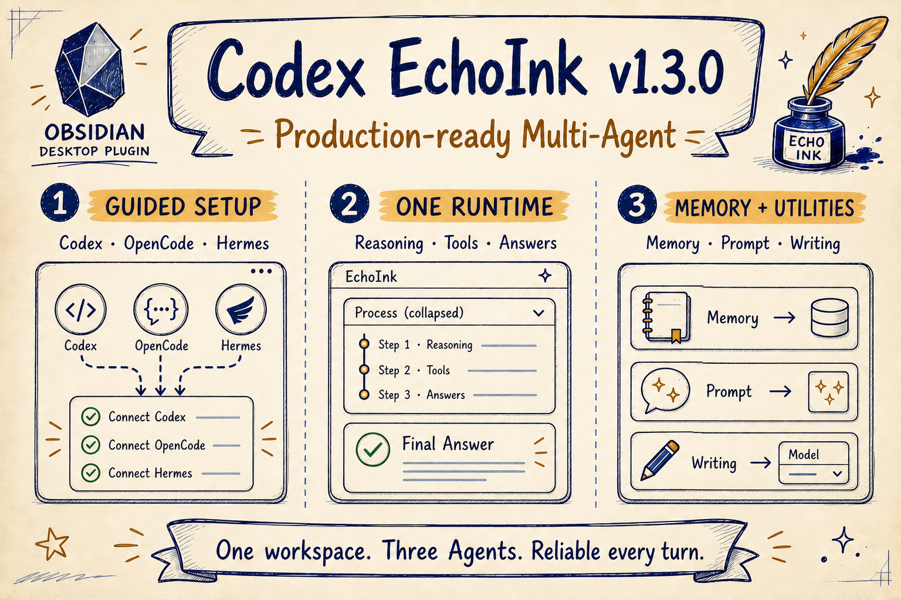
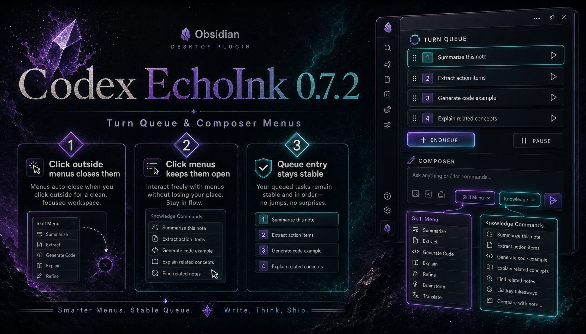
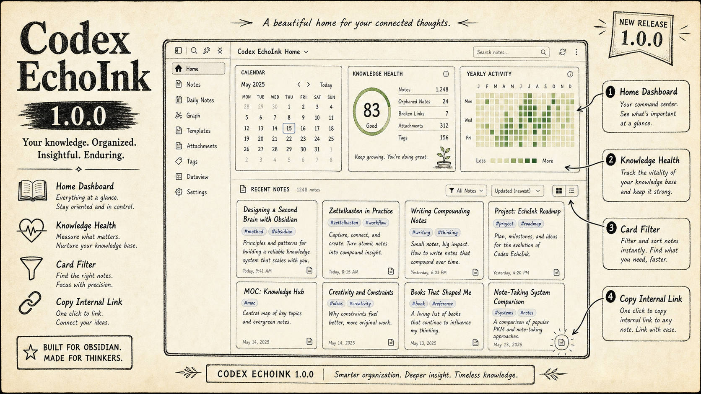
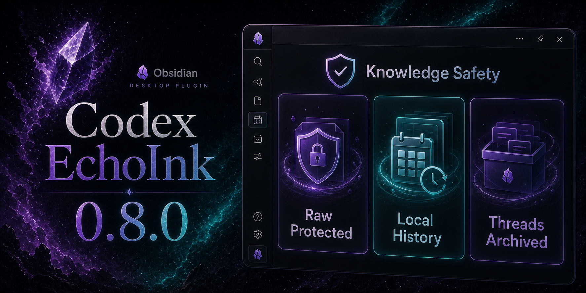
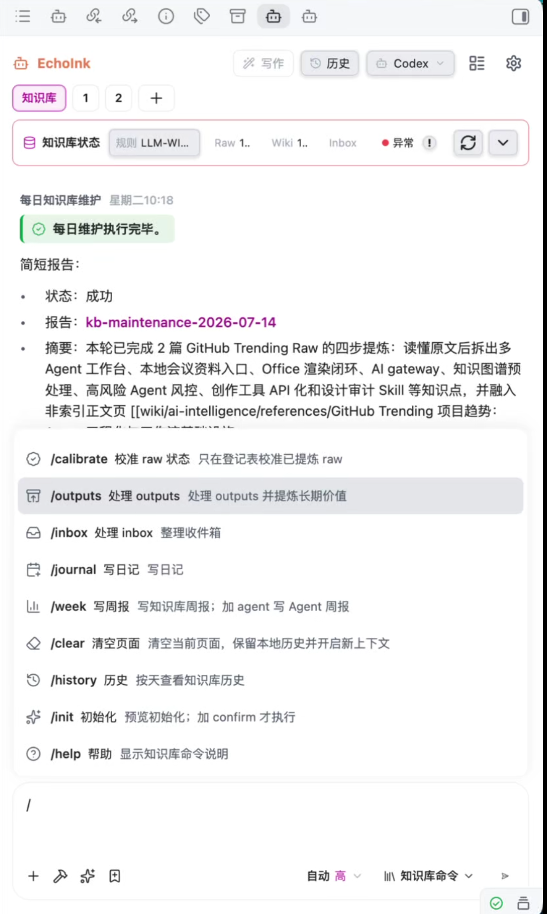
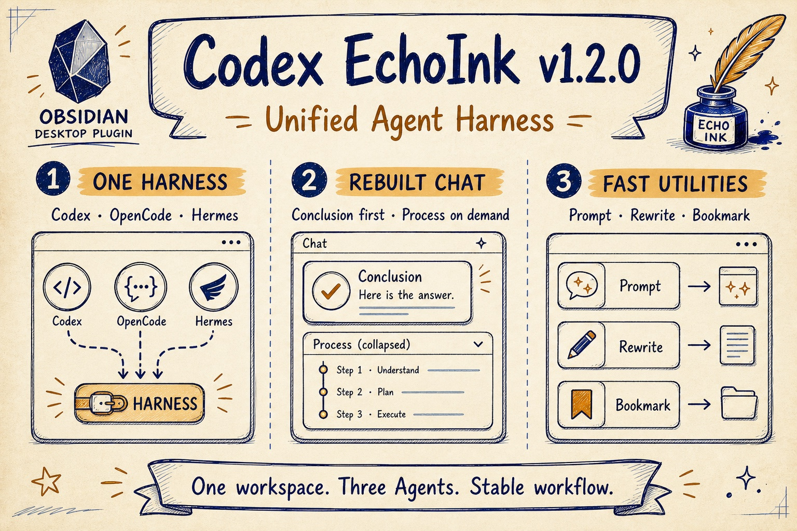
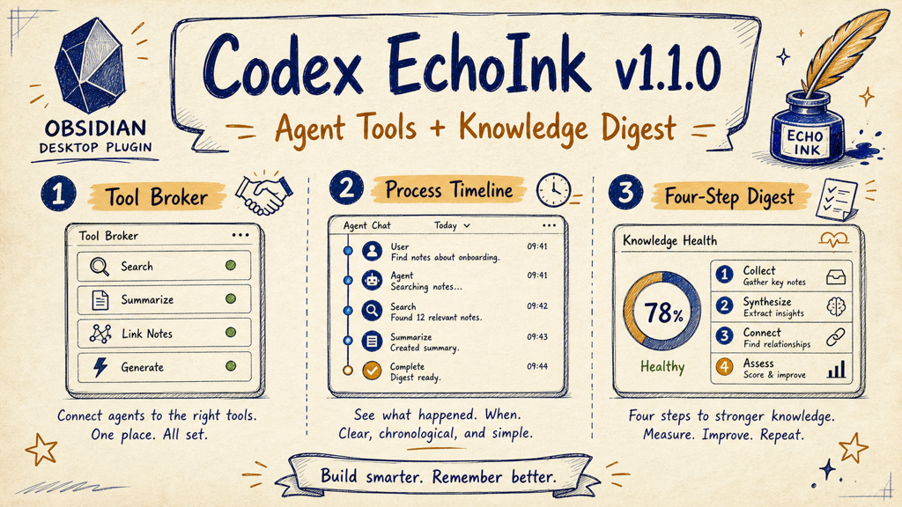
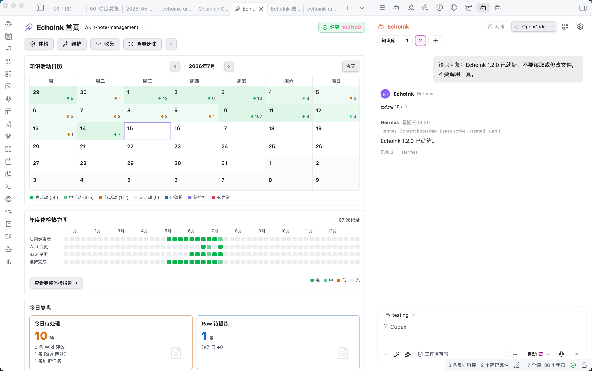
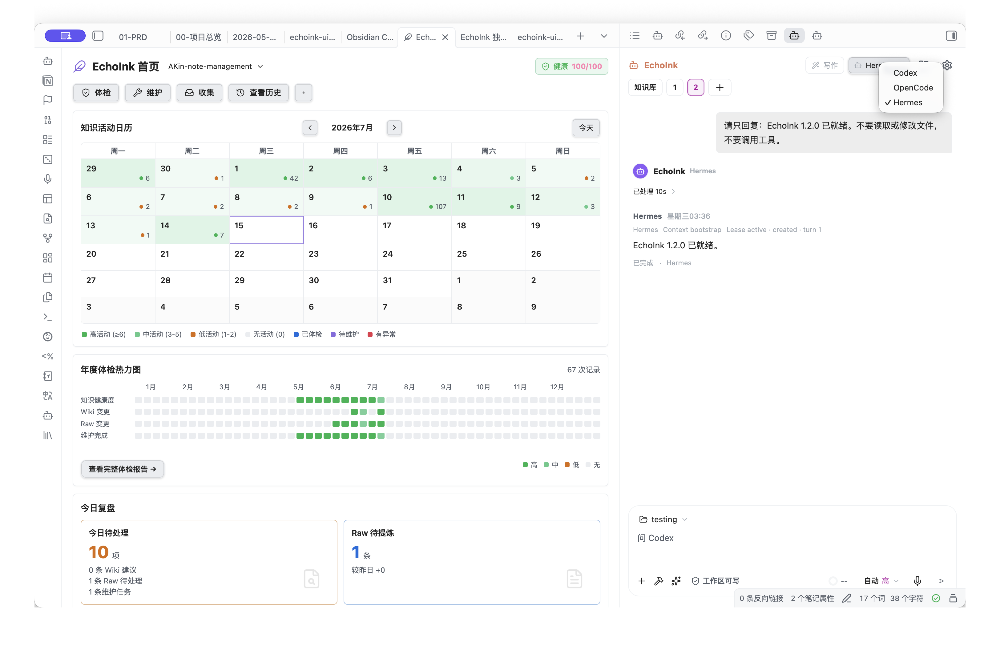
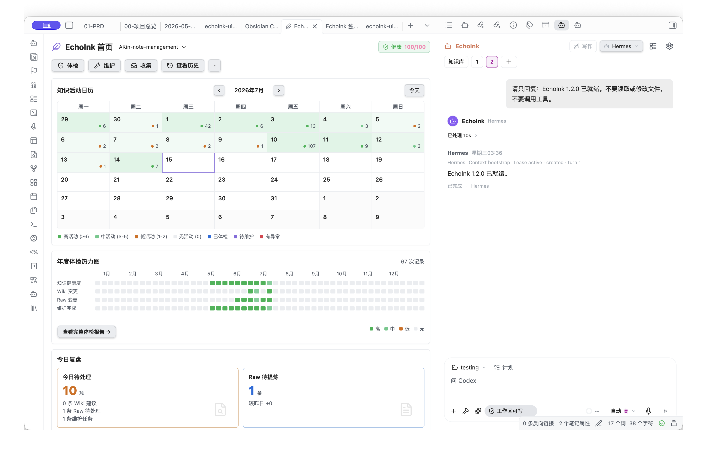

<p align="center">
  <a href="https://github.com/AKin-lvyifang/codex-echoink">
    
  </a>
</p>

<h1 align="center">Codex EchoInk</h1>

<p align="center">
  <a href="#功能特性">功能特性</a> ·
  <a href="docs/echoink-product-whitepaper.md">白皮书</a> ·
  <a href="#为什么叫-echoink">命名</a> ·
  <a href="#更新说明">更新说明</a> ·
  <a href="#安装">安装</a> ·
  <a href="#快速开始">快速开始</a> ·
  <a href="#隐私与权限">隐私与权限</a> ·
  <a href="#截图">截图</a> ·
  <a href="#本地开发">本地开发</a> ·
  <a href="#使用要求">使用要求</a> ·
  <a href="#许可证">许可证</a> ·
  <a href="README.md">English</a>
</p>

<p align="center">
  <a href="https://github.com/AKin-lvyifang/codex-echoink/releases/latest">
    
    
    
    
  </a>
</p>

<p align="center">
  <a href="https://github.com/AKin-lvyifang/codex-echoink/releases/latest"><strong>下载 v1.3.0</strong></a>
  ·
  <a href="https://github.com/AKin-lvyifang/codex-echoink/releases/latest">最新 Release</a>
</p>

---

<a id="功能特性"></a>
## 功能特性

### 首次启动向导


- 开始使用前先检测 Codex CLI、Codex 登录态、OpenCode CLI、OpenCode server、模型和 Agent。
- 缺少必要环境时，优先显示缺失项、安装命令、复制按钮和官方文档入口。
- 用户安装或登录后点击 `重新检测`，阻断项清除后才显示 `Start`。
- `Start` 只打开 EchoInk 侧栏并记录 setup 完成状态，不会自动发送消息，也不会自动跑知识库任务。
- 整个安装过程保持显式：不静默安装，不做意外后台 Agent 工作。

### 多 Agent 工作区

- 在 Obsidian 侧栏中打开 EchoInk Agent。
- 支持 Codex CLI、OpenCode API、Hermes 作为可切换 Agent 后端。
- 三个后端统一进入 EchoInk Harness，共用运行状态、上下文规则、会话管理和对话投影。
- 可从侧栏顶部切换主 Agent，不会清空当前 EchoInk 会话。
- 普通会话需要先选择一个文件夹作为工作区。
- 附加笔记只作为本轮上下文，不会把整个 Vault 变成工作区。
- 知识库频道才默认绑定当前 Vault，用来维护 Raw、Wiki、Outputs 和 Inbox。
- 让当前选中的 Agent 后端按能力读取文件、查看文件夹、修改文档或执行允许的本地操作。
- 不需要在 Obsidian 和外部聊天窗口之间来回切换。

### Agent 式过程时间线

- Codex、OpenCode、Hermes 使用同一套 EchoInk 对话格式，不随后端切换界面。
- 最终回答优先显示；思考、命令、文件编辑和 MCP 调用收进可展开的处理时间线。
- 收起时只显示处理时长，展开后再查看完整过程。
- 被处理的文件会显示为文件 chip，vault 内文件可回到 Obsidian 打开。
- 每轮 token 和上下文占用保持可见，但原始日志不会淹没回答。
- 支持 Agent / Plan 模式、模型选择、思考强度、速度和文件权限模式。

### 任务队列



- 当前 Agent 任务还在跑时，可以继续把后续任务加入队列。
- 队列按会话隔离，普通对话和知识库频道互不混用。
- 入队时会锁定文本、附件、Skill、模型、权限、模式和工作区。
- 输入框上方显示排队卡片，未执行任务可以删除，也可以拖动改顺序。
- 当前任务成功后才自动执行下一条；停止或失败后队列暂停，等你手动继续。
- `/ask`、`/maintain`、`/journal` 等知识库命令会串行执行，避免并发污染上下文。

### 首页工作台



- 可在设置里开启 Obsidian 启动时默认打开 EchoInk 首页。
- 首页标签页可以关闭，也可以通过 Obsidian 命令重新打开。
- Ribbon 图标会同时打开 EchoInk 侧栏和首页。
- 首页展示 Wiki 状态、Raw 待提炼、健康分数、年度体检热力图、日历和关键统计。
- 笔记卡片流会根据窗口宽度自适应，适合 14 寸笔记本和大屏。
- 支持按状态、推荐分组、更新时间、相关度和一级文件夹筛选。
- 每张卡片可复制 Obsidian 内链、相对路径和 Markdown 链接。

### 知识库自动化运维



- 新增常驻 `知识库` 频道，用来维护当前打开的 Obsidian vault。
- 聊天框是主入口：输入 `/init`、`/ask`、`/check`、`/maintain`、`/outputs`、`/journal`、`/inbox`，后面可以继续补充你的要求。
- 支持 LLM Wiki 初始化向导：先预览目录、规则文件和已有笔记分流建议，发送 `/init confirm` 后才创建模板。
- 支持 `/ask` 只读问答：先检索 Wiki，再把 Journal / Outputs 作为背景依据，并区分 Vault 依据和外部/模型补充。
- 支持 `/journal` 写日记：按当前 `journal/` 体系自动写入 daily 月份目录，并沿用最近日记格式；当天窗口为目标日 `00:00` 到次日 `06:00` 前，Codex CLI、OpenCode API、Hermes 分别使用对应后端证据规则。
- 知识库频道只保留最近有记录的一天；更早聊天按天保存到插件 `history/` 数据目录，并通过 `/history` 查看。
- Codex CLI 知识库任务会展示与普通 Agent 对话一致的过程卡片：思考、命令、文件改动、工具调用和最终结果。
- 知识库频道顶部状态面板升级为健康仪表盘：默认展示规则文件、Raw/Wiki/Inbox 数量和健康状态，展开后展示 Wiki 一级目录表、Raw/Inbox 表和年度体检热力图。
- 默认把 `LLM-WIKI.md` 作为知识库规则真源，也可以在设置里选择 Vault 内其他 Markdown。每轮知识库任务开始前，EchoInk 都会读取最新内容、校验文件并注入系统上下文；文件缺失或不可读时不会启动 Agent。`AGENTS.md` 可不存在，也不会被合并为知识库规则。
- 内置 EchoInk Memory V2，作为并行的本地记忆层，不禁用也不替代 Codex、OpenCode、Hermes 自带的 memory。普通 Agent 对话和 `/ask` 会在系统上下文里收到一份精简目录，需要旧信息时可按需搜索完整的插件本地使用记录，不会把全部历史一次性塞进上下文；同时可跨会话、跨后端读取同一份提炼后的本地记忆。维护类工作流只在本地提交成功后记录结果。正式提炼数据保存在 Vault 的 `.echoink/memory/index.json`，设置页可初始化、同步、恢复、处理冲突、删除记录，并显式导入旧 `.codex-memory`。外部 [`codex-memory-lite`](https://github.com/AKin-lvyifang/codex-memory-lite) 仍可独立兼容使用，但不再是 EchoInk 长期记忆的必需依赖。
- 支持把公众号、网页、文本资料先收进 Raw Sources。
- 四步提炼：读懂 Raw，拆出可复用知识，写入 Wiki / Projects 结构化正文，再在来源证据通过后回写 Raw 托管状态。
- 提炼 = 写入 Wiki / Projects + 来源证据 + Raw 托管状态，不等于摘要。
- `/check` 是提炼审计，只验真；`/maintain` 执行四步提炼；`/reingest` 强制重新提炼；`/calibrate raw` 只做状态校准，不调用 Agent 重新提炼。
- 知识库历史保存在插件本地 `history/` 目录，删除 Codex 已归档会话后仍可通过 `/history` 查看记录。
- 知识库命令产生的后台 Codex 会话会在本地历史保存后自动归档，减少对 Codex Desktop 最近会话列表的污染。
- 支持手动运行，也支持 Obsidian 打开时的每日维护。

### 复盘周报

- 设置页新增 `复盘`，默认关闭自动任务。
- 可分别启用 `知识库周报` 和 `Agent 对话周报`。
- 默认每周日 21:00 生成；错过后下次打开 Obsidian 自动补跑。
- 周报写入 `outputs/obsidian-weekly-review/`，同时生成 Markdown 和同名 HTML。
- HTML 使用固定看板模板，只替换数据，并通过 EchoInk 内置预览打开。

### 本地优先集成

- 选择 Codex 时复用本机 Codex CLI 登录状态。
- 已安装并配置时，也可以把 OpenCode 或 Hermes 作为本地 Agent 后端。
- 默认不要求保存 OpenAI API key。
- 可选配置 OpenAI Responses API 兼容的自定义 Provider，并为同一个 Provider 保存多个模型。
- 支持为插件启动的 Codex 子进程配置本地代理。
- MCP、Skills、工具包开关只作用于当前 vault，不改 Codex、OpenCode 或 Hermes 全局配置。
- 新增 EchoInk MCP broker 基础层：带显式 `metadata.mcp` 连接配置的 MCP 资源可以列工具，并在审批后通过 EchoInk 调用和记录日志；仅导入的 MCP 会显示但不会被假装成可调用。
- 当前 vault 的资源支持搜索，并可按聊天、知识库、写作三个 scope 独立开关。

### 多 Agent 后端模式

- 保留原来的 Codex CLI 模式，适合复用本机 Codex 登录态。
- 新增 OpenCode API 模式，可用于普通聊天、写作和知识库任务。
- 可检测或连接 OpenCode server，刷新可用模型，并选择当前 OpenCode 模型。
- 可刷新并选择 OpenCode Agent，让不同知识库工作流使用不同 Agent 配置。
- 新增 Hermes CLI/API 设置，适合使用 Hermes profile、memory 和 provider 配置。
- Hermes 的推理 provider 建议继续通过 Hermes 官方 `hermes model` 或环境文件配置；EchoInk 只保存当前连接元信息。
- EchoInk 为所有后端提供统一对话格式和终止状态；可展示的原生事件细节仍取决于对应 Agent 是否提供。

### 写作上下文 Harness

- 在编辑区对选中文字执行改写、扩写、续写和翻译成英文。
- 支持 `快速`、`质量`、`严格` 三档写作质量模式。
- 用可见的“文章理解”替代隐藏后台摘要，不再偷偷抢链路。
- 侧栏写作上下文面板会展示当前笔记、模型、理解状态和结构化文章理解。
- 小幅连续改写、扩写、续写或翻译会复用已有文章理解，避免每次都重新理解全文。
- 返回灰色候选，按 `Enter` 接受，按 `Esc` 取消。
- 可按写作后端设置走 Codex、OpenCode 或 Hermes。
- 改写、扩写、续写等操作作为独立轻量任务使用自己的快速模型路由，不改变主 Agent 的聊天模型。

这个功能仍处于实验阶段，默认关闭；但 v0.3.0 已经把它升级成更完整、可见、可控的写作流程。

### 提示词增强与收藏路由

- 输入区新增 Sparkles 图标，可在发送前把简短需求增强为更完整的提示词。
- 提示词增强拥有独立的 Agent 后端、Provider、API 路径和模型设置，不与主 Agent 或编辑区写作设置混用。
- 默认使用内置 WorkBuddy Meta-Prompt，增强后可继续编辑，也可一键还原原输入。
- 公众号和公开网页合并为一个“收藏”入口，插件会根据粘贴的链接自动选择采集路径。

<a id="为什么叫-echoink"></a>
## 为什么叫 EchoInk

Codex EchoInk 的本质是：将“墨水（Ink，记录）”凝聚成“古抄本（Codex，知识库）”，并在未来产生“回响（Echo，灵感激活）”。

- `Ink` 是记录：笔记、摘录、草稿、资料和对话。
- `Codex` 是知识库：结构化 wiki、索引、报告和可追溯来源。
- `Echo` 是激活：知识库问答、维护任务、写作辅助，以及未来的灵感触发。

它对应 Obsidian 的核心链路：先记录，再整理，最后被自己的知识重新启发。

<a id="更新说明"></a>
## 更新说明

### v1.3.0


**稳定可用的多 Agent 工作区：** Codex、OpenCode、Hermes 现在共用一套安装引导、运行投影和恢复机制；EchoInk 同时新增本地 Memory V2 与按后端能力显示的轻量模型设置。

- 在同一个设置面板中安装、修复、重新检测和查看三个 Agent 后端。
- 三个后端使用同一套结论优先对话界面，公开推理和工具过程按需展开。
- 使用 Memory V2 在本地提炼并跨会话、跨后端读取信息，同时保留各 Agent 原生记忆。
- 每轮知识库任务开始前重新读取并校验指定的 Markdown 规则文件，不再依赖 `AGENTS.md`。
- 提示词增强不改动主聊天模型，可独立选择后端模型，也可以输入模型 ID 新增选项。
- 现有 Vault 文件和 EchoInk 会话无需迁移。

### v1.2.2

**Obsidian 审核兼容修复：** Agent 参数菜单现在使用 Obsidian 允许的样式接口，修复 `v1.2.1` 被自动源码审核标记为失败的问题。

- 菜单定位、显隐和交互行为保持不变。
- 现有 Vault 文件、会话和设置无需迁移。

### v1.2.1



**轻量知识库命令菜单：** 在知识库频道输入 `/` 后，菜单改为更干净的响应式列表。默认不再铺厚重彩色卡片，只在当前项显示浅灰背景，命令名使用黑色，图标和说明使用中性灰。

- 使用 `↑` / `↓` 在命令间循环选择，长列表会自动跟随当前项滚动。
- 按 `Enter` 只把命令填入输入框，不会直接发送；按 `Esc` 关闭菜单。
- 现有 Vault 文件、会话和设置无需迁移。

### v1.2.0



**统一 Agent Harness 与全新侧栏：** EchoInk 现在为 Codex、OpenCode、Hermes 统一管理运行生命周期、上下文和对话投影；整个侧栏也围绕“先看结论、按需展开过程”和更轻量的响应式输入区重新设计。

**后端大改版：**

- 普通对话、知识库、写作和提示词增强统一进入 EchoInk Harness，再由 Adapter 对接具体后端。
- Codex、OpenCode、Hermes 共用运行状态、上下文规则、原生会话租约、停止和超时口径。
- 切换主 Agent 后下一轮立即生效，不清空当前会话；单项能力明确固定的后端仍保持优先。

**UI 完全重构：**

- 最终回答成为视觉主线，思考、命令、编辑和工具调用收进可展开的处理时间线。
- 工作区、Plan 状态、收藏、Skill、提示词增强、权限、模型、推理和速度统一为响应式 Codex 风格输入区。
- 顶部新增三 Agent 切换器，MCP 和设置按钮改为轻量透明样式；参数菜单会根据窄侧栏自动调整方向。

**新增功能与修复：**

- 新增独立提示词增强设置、WorkBuddy Meta-Prompt 和简洁的“还原”操作。
- 写作和提示词等轻量任务默认使用快速模型路由，不改动主 Agent 聊天模型。
- 公众号和公开网页合并为一个“收藏”入口。
- 修复消息吸底、知识库任务与报告抖动、终止状态不一致、部分升级仍显示旧输入区，以及窄侧栏溢出。

**使用方法：**

1. 安装 `v1.2.0` 并重载 Obsidian。
2. 在 EchoInk 顶部选择 Codex、OpenCode 或 Hermes。
3. 点击 Sparkles 图标增强当前输入；需要指定轻量任务模型时，再到设置中单独配置。
4. 已有 Vault 文件、会话和自定义模型设置无需迁移。

### v1.1.0



**Agent 工具和知识提炼更新：** EchoInk 现在能更清楚地展示 Agent 在做什么，也能更清楚地连接当前 vault 里的工具资源，并用更严格的四步流程维护知识库。

**更新内容：**

- 新增工具代理基础层：vault 资源、MCP 工具、Skills 和工具包有更清楚的开关和作用范围。
- Agent 过程时间线更清楚：搜索、文件处理、工具调用和完成状态更容易看懂。
- 知识库提炼流程更严格：先读懂 Raw，再拆出知识，写入 Wiki / Projects，最后确认来源证据后才标记 Raw。
- 新增 Hermes 后端的第一阶段入口；Hermes 的模型和 provider 仍由 Hermes 自己配置。
- 将大型 Agent 侧栏拆成更小的界面模块，后续维护和审核更稳。

**使用方法：**

1. 安装 `v1.1.0`。
2. 在 Obsidian 中打开 EchoInk，选择你正在使用的 Agent 后端。
3. 在知识库频道使用 `/check`、`/maintain` 或 `/reingest` 检查和提炼 Raw 笔记。
4. 到设置里检查聊天、知识库、写作三个场景的资源开关。

### v1.0.3

**审核样式修复版：** 这次主要修 Obsidian 社区审核里的直接样式赋值问题，不改变 EchoInk 核心使用流程。

**修复内容：**

- 将 Agent 侧栏里的直接样式赋值改为 Obsidian 支持的 `setCssStyles` 和 `setCssProps`。
- 保持知识库健康分 tooltip、年度热力图、虚拟消息列表和上下文用量环的显示逻辑不变。
- 增加回归测试，避免后续再次引入不符合官方审核规则的直接样式赋值。

**使用方法：**

1. 安装 `v1.0.3`。
2. 正常打开 EchoInk 首页或 Agent 侧栏即可。

### v1.0.2

**审核兼容修复版：** 这次主要修 Obsidian 社区审核发现的源码兼容问题，不改变 EchoInk 核心使用流程。

**修复内容：**

- 调整视图注册方式，不再把 view 实例缓存到插件属性上。
- 插件卸载时不再强制关闭 EchoInk 面板，避免重载后打乱工作区布局。
- 移除对高于当前 `minAppVersion` 的 Obsidian API 依赖。

**使用方法：**

1. 安装 `v1.0.2`。
2. 正常打开 EchoInk 首页、Agent 侧栏或复盘预览即可。

### v1.0.1

**小功能修复版：** 这次主要修首页日历、知识库维护稳定性和大文件读取风险。

**修复内容：**

- 首页日历支持切换上个月、下个月，并可一键回到本月。
- `/maintain` 会预检 Wiki 数字后缀冲突副本，并转移到 `outputs/maintenance/conflict-duplicates-*`。
- 知识库维护会阻止用 `标题 2.md` 这类数字后缀绕开同名 Wiki，优先更新正式页或报告冲突。
- Dashboard、Raw discovery 和 `/ask` 增加文件读取预算，避免大 PDF、图片和超大 Markdown 被完整读入。
- 超预算 Raw 不会被写入 tracker，也不会被误标记为已处理。

**使用方法：**

1. 安装 `v1.0.1`。
2. 如果 Wiki 里有数字后缀冲突副本，运行 `/maintain`。
3. 在维护报告里查看转移记录和未纳入本轮的大文件 Raw。

### v1.0.0

**首页工作台更新：** EchoInk 现在可以作为 Obsidian 里的知识库管理首页使用。

**更新内容：**

- 新增可关闭的首页标签页，可在设置里开启默认打开，也可从 Obsidian 命令面板重新打开。
- Ribbon 图标会同时打开 EchoInk 侧栏和首页。
- 首页展示 Wiki 健康、Raw 待处理、年度体检热力图、日历、健康分数和关键统计。
- 新增自适应笔记卡片流，用来查看最近 Wiki 更新和推荐笔记。
- 支持按标签、更新时间、相关度和一级文件夹筛选卡片。
- 卡片更多菜单支持复制 Obsidian 内链、相对路径和 Markdown 链接。

**使用方法：**

1. 在 EchoInk 设置里开启启动时打开首页。
2. 从 Ribbon 图标或 Obsidian 命令面板打开首页。
3. 用卡片区上方的筛选项聚焦要看的笔记。
4. 在卡片更多菜单里复制需要的链接格式。

### v0.8.0

**知识库安全更新：** Raw 原始资料、本地历史和后台 Codex 会话现在分层处理。

**更新内容：**

- 强化 `/check`、`/maintain`、`/calibrate raw` 的 Raw 保护，任务失败或取消时更容易回滚到干净状态。
- 知识库历史优先读插件本地 `history/`，不再依赖 Codex Desktop 已归档会话。
- 知识库命令创建的后台 Codex 会话会在结果保存后归档，减少 Codex Desktop 最近会话列表被挤占。
- 取消、重试错误、超时和状态保存失败的处理更稳定，UI 里的失败原因更容易看懂。
- dashboard 的 Raw 数量改为统计真实素材源，不再把 `.assets/` 图片附件算作 Raw 笔记。

**使用方法：**

1. 用 `/check` 做只读提炼审计。
2. 用 `/maintain` 对变更 Raw 执行四步提炼。
3. 用 `/history` 查看本地历史；删除 Codex 已归档会话不会删除插件历史。

### v0.7.2

**稳定性更新：** 任务队列和输入菜单的收起行为更可控。

**更新内容：**

- 点击输入区里非 Skill 菜单、非知识库命令菜单的位置时，会收起输入菜单。
- 点击 Skill 菜单或知识库命令菜单本身时，不会误关闭菜单。
- 补充输入菜单收起逻辑的单元测试，降低队列入口交互回归风险。

### v0.7.1

**稳定性更新：** 任务队列在成功、失败、停止和知识库任务并发场景下更可控。

**更新内容：**

- 任务成功后，只有队列里还有下一条才继续执行。
- 任务失败或手动停止后，队列会暂停并保留剩余任务，等待手动继续。
- 普通任务、知识库任务或队列启动中时，不会并发启动下一条排队任务。
- 拖动队列卡片时，事件只留在队列区域，不会误触发输入框附件拖放。

### v0.7.0

**新功能：** 普通对话和知识库频道都支持任务队列。

**更新内容：**

- 输入框上方新增会话级队列。
- 当前任务运行中，输入框有内容时，主按钮变成 `入队发送`。
- 当前任务运行中，输入框为空时，主按钮仍然是停止当前任务。
- 队列项会锁定入队时的文本、附件、Skill、模型、权限、模式和工作区。
- 任务成功后自动执行下一条。
- 任务失败或手动停止后，队列暂停并保留剩余任务，可手动继续。
- `/ask`、`/maintain`、`/journal` 等知识库命令通过队列串行执行。

**使用方法：**

1. 先发送一个普通对话或知识库命令。
2. 当前任务还在跑时，继续输入下一条任务。
3. 点击 `入队发送`。
4. 在输入框上方调整顺序或删除未执行任务。
5. 如果任务停止或失败，点击 `继续队列` 恢复后续任务。

### v0.6.0

**启动向导与知识库维护更新：** 新增首次启动环境检测、重新检测和明确的 `Start` 入口，同时强化知识库维护边界。

**新功能：**

- 设置页新增首次启动向导，检测 Codex CLI、Codex 登录态、OpenCode CLI、OpenCode server、模型和 Agent。
- 缺少必要运行环境时，会显示安装命令、复制按钮和官方文档入口。
- 新增 `重新检测`，可重新探测 CLI 路径、刷新 Codex 登录态，并在需要时连接或启动 OpenCode。
- 新增 `Start` 作为明确完成步骤。点击后只打开 EchoInk 侧栏，不自动发送消息，也不自动跑知识库任务。

**修复与维护：**

- Codex CLI 和 OpenCode CLI 自动探测补充 Windows 常见安装路径。
- 知识库历史升级为按天归档，并在设置页提供索引、导出和压缩工具。
- 知识库维护不再让 Agent 直接改写 Raw 原始正文；raw 路径归一由插件侧校验处理。
- 优化知识库维护报告、dashboard 状态、本地笔记链接和历史入口位置。

### v0.5.2

**知识库工作流与 Windows 诊断更新：** 新增周报复盘，优化 `/journal`，让知识库运行过程更可见，并修复容易触发 Windows WebSocket 失败的 `gpt-5.5` 默认模型问题。

**新功能：**

- 新增知识库周报和 Agent 对话周报，支持定时或手动生成，并输出 Markdown + HTML 到 `outputs/obsidian-weekly-review/`。
- 新增 EchoInk 内置 HTML 预览，用来打开生成的周报。
- 知识库频道新增 `/week` 和 `/week agent` 快捷命令。
- `/journal` 改为写入当前 `journal/daily/YYYY-MM/YYYY-MM-DD-周X.md` 结构，自动创建缺失的 journal 目录，并固定使用目标日 `00:00` 到次日 `06:00` 前作为工作窗口。
- 知识库后端使用 OpenCode API 时，`/journal` 会读取 OpenCode 聊天记录作为当天证据。
- `/ask` 的本地依据从 `wiki/` 扩展到 `wiki/`、`journal/` 和 `outputs/`，并带上来源集合、引用片段、证据强度和命中原因。
- 设置页新增中文 / English 显示语言切换。

**修复：**

- Codex CLI 默认模型改为 `自动`；旧用户保存的 `gpt-5.5` 默认值会迁移为 `自动`。
- 移除知识库任务和 Plan 模式里残留的 `gpt-5.5` 硬编码兜底。
- 新增 WebSocket、代理拒绝、CLI 缺失、超时和 app-server 退出的详细诊断。
- README 增加 Windows `responses_websocket` / `os error 10061` 排障说明。
- 复盘设置页精简为确认后生成，并显示更清楚的输出路径。
- Codex CLI 知识库任务会进入普通过程时间线，思考、命令、文件改动和最终结果都在同一条链路里展示。
- 知识库频道里的普通输入默认按普通 Agent 对话处理；只有显式 `/ask`、`/query`、`/问`、`/查询` 才触发知识库问答。
- 知识库频道里的普通 Agent 对话运行中，主按钮会停止当前对话，不再误触发知识库任务取消。
- 知识库失败信息保留更完整的 app-server、JSON-RPC、OpenCode 和 turn 错误细节，方便排查。
- 知识库回复里的本地笔记路径和报告路径会渲染成可点击笔记链接。

### v0.5.1

**社区审核修复版：** 移除 `manifest.json` 描述里冗余的 `Obsidian` 字样，并删除旧的 `main` manifest 字段，满足社区自动检查。

### v0.5.0

**社区上架准备版：** 插件正式更名为 `Codex EchoInk`，社区插件 id 改为 `codex-echoink`，并补齐 Obsidian 审核需要的隐私和权限说明。

**更新内容：**

- 插件从 `Codex for Obsidian` / `obsidian-codex` 更名为 `Codex EchoInk` / `codex-echoink`。
- 安装路径、Release 链接、打包产物和公开仓库引用都切换到新名称。
- 兼容旧手动安装版放在 `.obsidian/plugins/obsidian-codex/raw` 下的大型原文缓存。
- 新增隐私与权限说明，覆盖 Codex CLI、OpenCode、模型服务、自定义 API key 和知识库写入边界。
- 准备社区安装所需 Release 资产：`main.js`、`manifest.json`、`styles.css` 和 `codex-echoink-0.5.0.zip`。

### v0.4.1

**新功能：** 知识库频道增强，让提问、体检可视化和能力开关更好用。

**更新内容：**

- 新增 `/ask` 只读问答。它会先检索 `wiki/` 里的相关笔记，把命中的笔记作为上下文，再要求 Agent 区分“来自 Vault 的依据”和“补充信息 / 推断”。
- 当前行为下，知识库只读问答必须显式使用 `/ask`；普通自然语言会按普通 Agent 对话处理。
- 知识库健康热力图从最近短周期升级为 GitHub 风格年度视图，带月份、星期、成功和失败状态。
- Codex CLI 模式下，知识库频道底部可以直接选择模型和思考强度；知识库任务不再固定使用同一个强度。
- 当前 vault 的能力管理页新增搜索栏，`插件`、`MCP`、`Skills` 三个标签都可以搜名称、id/路径、元信息和描述；多个词会同时匹配。
- 修复 Skills 等长文本把列表撑太宽的问题：名称、路径和描述写不下时用省略号，右侧勾选框不会被挤出去。
- 默认知识库规则文件保持为 `LLM-WIKI.md`，也可以选择 Vault 内其他 Markdown；规则由 EchoInk 每轮强制加载，不再回退到 `AGENTS.md`。

**使用方法：**

1. 打开 Agent 侧栏里的 `知识库` 频道。
2. 需要查询知识库时输入 `/ask 你的问题`。
3. 使用 Codex CLI 模式时，在输入框右下角选择模型和思考强度。
4. 展开知识库健康仪表盘，查看年度体检热力图。
5. 进入插件设置的当前 vault 能力管理，在 `插件`、`MCP` 或 `Skills` 标签下搜索后再勾选。

### v0.4.0

**新功能：** 知识库自动化运维，用来在 Obsidian 里维护当前 vault。

**更新内容：**

- 新增绑定当前 vault 的常驻知识库频道。
- 新增命令模板：`/check`、`/maintain`、`/outputs`、`/journal`、`/inbox`。
- 新增公众号、网页和文件收藏入口，把资料先收进 Raw Sources。
- 新增知识库操作指南文件设置。默认 `LLM-WIKI.md`，也可以改成自定义 Markdown 文件。
- 当时版本在设置页提供了 `codex-memory-lite` 外部兼容入口；当前版本已经内置 EchoInk Memory V2，不再要求外装 Skill 才能获得长期记忆。
- 新增 OpenCode 模型选择和 OpenCode Agent 选择。
- 新增编辑区选中文字翻译成英文。
- 优化知识库设置页对齐、运行状态说明和规则文件选择。
- 保留安全边界：不自动改写、删除或归档已有 Raw 正文。

**使用方法：**

1. 打开 Agent 侧栏里的 `知识库` 频道。
2. 在设置页选择知识库后端：`Codex CLI` 或 `OpenCode API`。
3. 如果使用 OpenCode 模式，先在本机安装 OpenCode，再刷新并选择模型和 Agent。
4. 新 vault 可先输入 `/init` 预览初始化方案；确认无误后输入 `/init confirm`。
5. 通过顶部健康仪表盘查看规则、Raw/Wiki/Inbox 数量、风险原因、目录更新和最近 `/check` 记录。
6. 在知识库频道输入 `/check 断链检查`、`/maintain 处理新增 raw`、`/outputs 整理本周输出`。
7. 用快捷入口收藏公众号、网页或文件资料。

### v0.3.0

**新功能：** 写作上下文 Harness，用于编辑区改写、扩写和续写。

**更新内容：**

- 新增 `快速`、`质量`、`严格` 三档写作质量模式。
- 新增侧栏可见的写作上下文面板。
- 新增结构化文章理解：主题、受众、写作目的、文章结构、关键事实、风格特征、禁止编造、局部写作建议。
- 新增文章理解软复用：小幅连续编辑后复用已有理解，不再每次重新理解全文。
- 新增严格模式审校：候选生成后再检查事实、风格、衔接和 Markdown。
- 保留灰色候选闭环：`Enter` 确认，`Esc` 取消。
- 文章理解不会进入普通聊天记录。

**使用方法：**

1. 在插件设置里开启写作操作。
2. 选择默认写作质量：`快速`、`质量` 或 `严格`。
3. 在编辑区选中文字，运行 `改写`、`扩写` 或 `续写`。
4. 点击侧栏顶部 `写作` 状态，查看或刷新文章理解。
5. 按 `Enter` 接受灰色候选，或按 `Esc` 取消。

### v0.2.0

**Bug 修复：** 修复 Codex 账号重新登录后，插件因为找不到 Codex Desktop 内置 CLI 而报 `spawn codex ENOENT` 的问题；设置页新增“刷新登录状态”按钮。

**实验功能：** 编辑区选中文字后可执行改写、扩写、续写，并在原地显示候选。该功能仍处于实验阶段，默认关闭，不成熟，不建议日常稳定使用。

**测试方法：**

1. 在插件设置里开启写作操作。
2. 在编辑区选中文字，右键选择 `改写`、`扩写` 或 `续写`。
3. 按 `Enter` 接受灰色候选，或按 `Esc` 取消。
4. 先在非关键笔记里测试。

### v0.1.2

**新功能：** 公开发布内容保护，GitHub 仓库只保留安装和使用必要内容。

**使用方法：**

1. 下载最新 Release 安装包。
2. 安装 `codex-echoink` 插件文件夹。
3. 直接使用插件，不需要阅读内部项目文档。

### v0.1.1

**新功能：** 在 Codex 输入框里直接粘贴微信截图或系统截图。

**使用方法：**

1. 截图。
2. 点击 Codex 输入框。
3. 按 `Command+V`，然后发送。

<a id="安装"></a>
## 安装

1. 使用 Codex CLI 模式时，先安装并登录 Codex CLI。
2. 如果要使用 OpenCode 或 Hermes 后端，额外在本机安装对应 CLI/runtime。
3. 如果 Obsidian 社区插件里已经可用，直接搜索并安装 `Codex EchoInk`。
4. 如果手动安装，先在你的 vault 里创建插件目录：

```text
<vault>/.obsidian/plugins/codex-echoink/
```

5. 在 [最新 Release](https://github.com/AKin-lvyifang/codex-echoink/releases/latest) 下载 `main.js`、`manifest.json`、`styles.css`，把这 3 个文件放进上面的目录。
6. 重启 Obsidian，在第三方插件里启用 `Codex EchoInk`。

插件文件夹里应包含：

```text
codex-echoink/
  main.js
  manifest.json
  styles.css
```

<a id="快速开始"></a>
## 快速开始

1. 从 Ribbon 图标或命令面板打开 EchoInk Agent 侧栏。
2. 在普通会话底部选择一个文件夹作为工作区。
3. 在设置里选择默认 Agent 后端：Codex、OpenCode 或 Hermes。
4. 让当前 Agent 检查、总结、改写或管理该工作区里的文件。
5. 需要时附加笔记、文件、图片、Skills 或导入的 MCP 资源；附件只作为上下文。
6. 通过过程卡片查看命令、编辑、上下文用量和结果证据。Codex 过程最完整；OpenCode/Hermes 在没有 richer event API 时显示简化运行状态。
7. 需要维护知识库时，打开 `知识库` 常驻频道。
8. 新 vault 先用 `/init` 预览初始化方案；已有结构的 vault 先用 `/check` 做安全体检，再按需要用 `/ask` 提问、`/maintain` 维护，或用 `/outputs` 写入结构化知识。

<a id="故障排查"></a>
## 故障排查

### Windows WebSocket 或 `os error 10061`

如果 Codex CLI 日志里出现 `responses_websocket`、`wss://chatgpt.com/backend-api/codex/responses`、`actively refused` 或 `os error 10061`，通常是 Codex CLI 的 ChatGPT 登录态 WebSocket 连接被系统、代理或网络拒绝。

可以按这个顺序处理：

1. 把插件默认模型设为 `自动`，或手动选择非 `gpt-5.5` 模型。
2. 如果当前网络需要本地代理，在插件设置里启用本地代理，并填写例如 `http://127.0.0.1:7890`。
3. 在设置页重连 Codex，或重启 Obsidian。
4. 如果仍失败，请提供插件新的详细错误和脱敏后的 Codex CLI 日志。

<a id="隐私与权限"></a>
## 隐私与权限

- Codex EchoInk 仅支持桌面端，因为它会调用本机命令行工具。
- Codex CLI 模式复用本机 Codex CLI 登录态，可能把你选择的 prompt、附件和文件上下文发送给 Codex 配置的模型服务。
- OpenCode API 模式连接本机或用户配置的 OpenCode server；插件可以启动或停止 `opencode serve`，但不会静默安装 OpenCode。
- Hermes 模式调用本机 Hermes CLI 或配置的 Hermes API server。EchoInk 可以保存 Hermes server URL、profile、provider、model 和可选 API server key，但不会静默改写 Hermes 全局 provider 配置。
- 自定义 API Provider 的 key 会保存在本机 Obsidian 插件数据中，只建议在可信设备上使用。Hermes 推理 provider key 建议继续放在 Hermes 自己的配置里。
- 插件默认不会上传整个 vault。普通会话必须先选择工作区文件夹，附加笔记只作为当前轮上下文。
- 知识库管理任务会保护 Raw 来源内容：正文、标题、路径和对应 `.assets` 附件目录不可改；Markdown raw 的提炼指纹按正文计算。只有 Wiki / Projects 已有结构化知识和来源证据后，EchoInk 后处理才会写入 `已处理`、`提炼状态`、`提炼指纹` 等托管元属性。普通 Agent 对话中，Raw 文件整理按你的明确指令和当前权限执行。
- MCP 和 Skill 会导入到 EchoInk 当前 vault 的资源目录；按 scope 的开关只影响 EchoInk，不写回 Codex、OpenCode 或 Hermes 全局配置。经 EchoInk broker 执行的 MCP 工具调用需要显式连接配置、审批和本地日志。

<a id="截图"></a>
## 截图








<a id="本地开发"></a>
## 本地开发

```bash
npm install
npm run test
npm run typecheck
npm run build
```

生成本地手动安装包：

```bash
npm run package
```

部署到自己的 Obsidian vault：

```bash
OBSIDIAN_VAULT=/path/to/your/vault npm run deploy
```

<a id="使用要求"></a>
## 使用要求

- Codex CLI 模式需要先在本机安装并登录 Codex CLI。
- OpenCode API 模式需要先在本机安装 OpenCode。插件可以连接或启动 OpenCode server，但不会静默安装 OpenCode。
- Hermes 模式需要先在本机安装 Hermes CLI。推理 provider 建议先通过 Hermes 官方配置完成，再在 EchoInk 里选择 CLI 或 API server。
- Codex CLI 模式下的自定义 API Provider 需要兼容 OpenAI Responses API，例如 `/v1/responses`；只支持 `/v1/chat/completions` 的通用 OpenAI 格式通常不可用。
- 自定义 API key 会保存在 Obsidian 插件数据里，只建议在可信本机使用。
- CLI 路径留空时会从 `PATH` 和常见安装目录自动查找；找不到时可在插件设置页手动填写。

<a id="许可证"></a>
## 许可证

Codex EchoInk 使用 [MIT License](LICENSE) 开源。

在保留版权声明和许可证声明的前提下，你可以按照 MIT License 允许的范围使用、复制、修改、合并、发布、分发、再授权或销售本软件。本软件按“现状”提供，不提供任何形式的担保。
