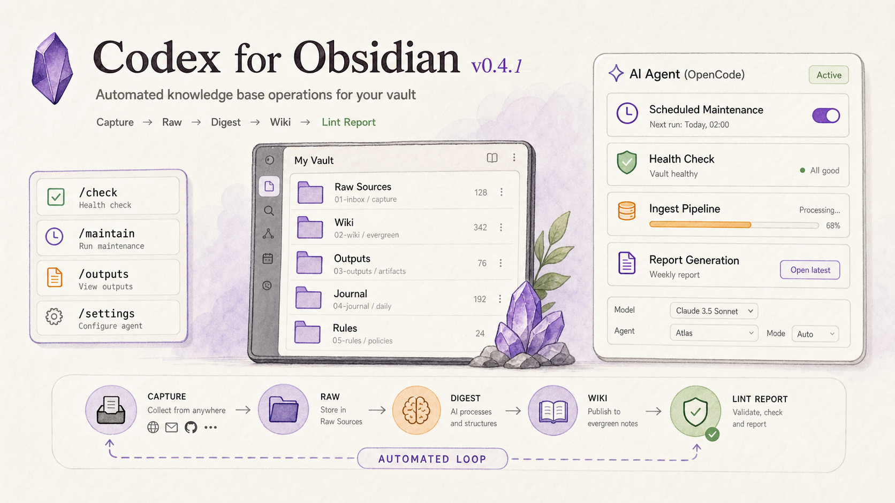

<a href="https://github.com/AKin-lvyifang/codex-echoink">
  
</a>

<h1 align="center">Codex EchoInk</h1>

<p align="center">
  <a href="#功能特性">功能特性</a> ·
  <a href="#为什么叫-echoink">命名</a> ·
  <a href="#更新说明">更新说明</a> ·
  <a href="#安装">安装</a> ·
  <a href="#快速开始">快速开始</a> ·
  <a href="#隐私与权限">隐私与权限</a> ·
  <a href="#截图">截图</a> ·
  <a href="#本地开发">本地开发</a> ·
  <a href="#使用要求">使用要求</a> ·
  <a href="#许可证">许可证</a> ·
  <a href="README.md">English</a>
</p>

<p align="center">
  <a href="https://github.com/AKin-lvyifang/codex-echoink/releases/latest">
    
    
    
    
  </a>
</p>

<p align="center">
  <a href="https://github.com/AKin-lvyifang/codex-echoink/releases/download/0.5.1/codex-echoink-0.5.1.zip"><strong>下载 v0.5.1</strong></a>
  ·
  <a href="https://github.com/AKin-lvyifang/codex-echoink/releases/latest">最新 Release</a>
</p>

---

<a id="功能特性"></a>
## 功能特性

### 会话级 Codex 工作区

- 在 Obsidian 侧栏中打开 Codex。
- 普通会话需要先选择一个文件夹作为工作区。
- 附加笔记只作为本轮上下文，不会把整个 Vault 变成工作区。
- 知识库频道才默认绑定当前 Vault，用来维护 Raw、Wiki、Outputs 和 Inbox。
- 让 Codex 读取文件、查看文件夹、修改文档、执行本地命令。
- 不需要在 Obsidian 和外部聊天窗口之间来回切换。

### Agent 式过程时间线

- 将思考、命令、文件编辑、MCP 调用和上下文用量渲染成可读过程卡片。
- 被处理的文件会显示为文件 chip，vault 内文件可回到 Obsidian 打开。
- 大输出和原始详情默认折叠，避免对话被日志淹没。
- 支持 Agent / Plan 模式、模型选择、思考强度、速度和文件权限模式。

### 知识库自动化运维

- 新增常驻 `知识库` 频道，用来维护当前打开的 Obsidian vault。
- 聊天框是主入口：输入 `/init`、`/ask`、`/check`、`/maintain`、`/outputs`、`/journal`、`/inbox`，后面可以继续补充你的要求。
- 支持 LLM Wiki 初始化向导：先预览目录、规则文件和已有笔记分流建议，发送 `/init confirm` 后才创建模板。
- 支持 `/ask` 只读问答：先检索 Wiki 相关笔记，再回答问题，并区分 Vault 依据和外部/模型补充。
- 知识库频道顶部状态面板升级为健康仪表盘：默认展示规则文件、Raw/Wiki/Inbox 数量和健康状态，展开后展示 Wiki 一级目录表、Raw/Inbox 表和年度体检热力图。
- 默认读取 `LLM-WIKI.md` 作为知识库规则真源；`AGENTS.md` 只保留 Agent 运行层背景。
- 可选推荐 [`codex-memory-lite`](https://github.com/AKin-lvyifang/codex-memory-lite) 来增强跨会话长期记忆；由你的 Agent 安装这个 Skill，并在工作区运行 bootstrap，插件不内置这套 Skills，也不会修改你的 `AGENTS.md`。
- 支持把公众号、网页、文本资料先收进 Raw Sources。
- 现有 Raw 正文保持只读，再把结构化结果写入 Wiki、Outputs、Journal 和 tracker。
- 支持手动运行，也支持 Obsidian 打开时的每日维护。

### 本地优先集成

- 复用本机 Codex CLI 登录状态。
- 默认不要求保存 OpenAI API key。
- 可选配置 OpenAI Responses API 兼容的自定义 Provider，并为同一个 Provider 保存多个模型。
- 支持为插件启动的 Codex 子进程配置本地代理。
- 插件、MCP、Skills 开关只作用于当前 vault，不改 Codex 全局配置。
- 当前 vault 的插件、MCP、Skills 开关支持搜索；长路径和长描述会自动省略，右侧勾选框保持可见可点。

### OpenCode API 模式

- 保留原来的 Codex CLI 模式，适合复用本机 Codex 登录态。
- 新增 OpenCode API 模式，适合用本机 OpenCode 做知识库任务。
- 可检测或连接 OpenCode server，刷新可用模型，并选择当前 OpenCode 模型。
- 可刷新并选择 OpenCode Agent，让不同知识库工作流使用不同 Agent 配置。

### 写作上下文 Harness

- 在编辑区对选中文字执行改写、扩写、续写和翻译成英文。
- 支持 `快速`、`质量`、`严格` 三档写作质量模式。
- 用可见的“文章理解”替代隐藏后台摘要，不再偷偷抢链路。
- 侧栏写作上下文面板会展示当前笔记、模型、理解状态和结构化文章理解。
- 小幅连续改写、扩写、续写或翻译会复用已有文章理解，避免每次都重新理解全文。
- 返回灰色候选，按 `Enter` 接受，按 `Esc` 取消。

这个功能仍处于实验阶段，默认关闭；但 v0.3.0 已经把它升级成更完整、可见、可控的写作流程。

<a id="为什么叫-echoink"></a>
## 为什么叫 EchoInk

Codex EchoInk 的本质是：将“墨水（Ink，记录）”凝聚成“古抄本（Codex，知识库）”，并在未来产生“回响（Echo，灵感激活）”。

- `Ink` 是记录：笔记、摘录、草稿、资料和对话。
- `Codex` 是知识库：结构化 wiki、索引、报告和可追溯来源。
- `Echo` 是激活：知识库问答、维护任务、写作辅助，以及未来的灵感触发。

它对应 Obsidian 的核心链路：先记录，再整理，最后被自己的知识重新启发。

<a id="更新说明"></a>
## 更新说明

### v0.5.1

**社区审核修复版：** 移除 `manifest.json` 描述里冗余的 `Obsidian` 字样，满足社区自动检查。

### v0.5.0

**社区上架准备版：** 插件正式更名为 `Codex EchoInk`，社区插件 id 改为 `codex-echoink`，并补齐 Obsidian 审核需要的隐私和权限说明。

**更新内容：**

- 插件从 `Codex for Obsidian` / `obsidian-codex` 更名为 `Codex EchoInk` / `codex-echoink`。
- 安装路径、Release 链接、打包产物和公开仓库引用都切换到新名称。
- 兼容旧手动安装版放在 `.obsidian/plugins/obsidian-codex/raw` 下的大型原文缓存。
- 新增隐私与权限说明，覆盖 Codex CLI、OpenCode、模型服务、自定义 API key 和知识库写入边界。
- 准备社区安装所需 Release 资产：`main.js`、`manifest.json`、`styles.css` 和 `codex-echoink-0.5.0.zip`。

### v0.4.1

**新功能：** 知识库频道增强，让提问、体检可视化和能力开关更好用。

**更新内容：**

- 新增 `/ask` 只读问答。它会先检索 `wiki/` 里的相关笔记，把命中的笔记作为上下文，再要求 Agent 区分“来自 Vault 的依据”和“补充信息 / 推断”。
- 支持自然问题自动进入问答流程，例如直接输入 `Harness Engineering 和 Vibe Coding 有什么关系？`，不用必须记住命令。
- 知识库健康热力图从最近短周期升级为 GitHub 风格年度视图，带月份、星期、成功和失败状态。
- Codex CLI 模式下，知识库频道底部可以直接选择模型和思考强度；知识库任务不再固定使用同一个强度。
- 当前 vault 的能力管理页新增搜索栏，`插件`、`MCP`、`Skills` 三个标签都可以搜名称、id/路径、元信息和描述；多个词会同时匹配。
- 修复 Skills 等长文本把列表撑太宽的问题：名称、路径和描述写不下时用省略号，右侧勾选框不会被挤出去。
- 默认知识库规则文件保持为 `LLM-WIKI.md`，`AGENTS.md` 仍作为兼容选项和运行层背景。

**使用方法：**

1. 打开 Codex 侧栏里的 `知识库` 频道。
2. 输入 `/ask 你的问题`，或者直接在知识库频道里问问题。
3. 使用 Codex CLI 模式时，在输入框右下角选择模型和思考强度。
4. 展开知识库健康仪表盘，查看年度体检热力图。
5. 进入插件设置的当前 vault 能力管理，在 `插件`、`MCP` 或 `Skills` 标签下搜索后再勾选。

### v0.4.0

**新功能：** 知识库自动化运维，用来在 Obsidian 里维护当前 vault。

**更新内容：**

- 新增绑定当前 vault 的常驻知识库频道。
- 新增命令模板：`/check`、`/maintain`、`/outputs`、`/journal`、`/inbox`。
- 新增公众号、网页和文件收藏入口，把资料先收进 Raw Sources。
- 新增知识库操作指南文件设置。默认 `LLM-WIKI.md`，也可以改成自定义 Markdown 文件。
- 设置页新增 `codex-memory-lite` 可选推荐，用于需要长期记忆的知识库维护工作流。
- 新增 OpenCode 模型选择和 OpenCode Agent 选择。
- 新增编辑区选中文字翻译成英文。
- 优化知识库设置页对齐、运行状态说明和规则文件选择。
- 保留安全边界：不自动改写、删除或归档已有 Raw 正文。

**使用方法：**

1. 打开 Codex 侧栏里的 `知识库` 频道。
2. 在设置页选择知识库后端：`Codex CLI` 或 `OpenCode API`。
3. 如果使用 OpenCode 模式，先在本机安装 OpenCode，再刷新并选择模型和 Agent。
4. 新 vault 可先输入 `/init` 预览初始化方案；确认无误后输入 `/init confirm`。
5. 通过顶部健康仪表盘查看规则、Raw/Wiki/Inbox 数量、风险原因、目录更新和最近 `/check` 记录。
6. 在知识库频道输入 `/check 断链检查`、`/maintain 处理新增 raw`、`/outputs 整理本周输出`。
7. 用快捷入口收藏公众号、网页或文件资料。

### v0.3.0

**新功能：** 写作上下文 Harness，用于编辑区改写、扩写和续写。

**更新内容：**

- 新增 `快速`、`质量`、`严格` 三档写作质量模式。
- 新增侧栏可见的写作上下文面板。
- 新增结构化文章理解：主题、受众、写作目的、文章结构、关键事实、风格特征、禁止编造、局部写作建议。
- 新增文章理解软复用：小幅连续编辑后复用已有理解，不再每次重新理解全文。
- 新增严格模式审校：候选生成后再检查事实、风格、衔接和 Markdown。
- 保留灰色候选闭环：`Enter` 确认，`Esc` 取消。
- 文章理解不会进入普通聊天记录。

**使用方法：**

1. 在插件设置里开启写作操作。
2. 选择默认写作质量：`快速`、`质量` 或 `严格`。
3. 在编辑区选中文字，运行 `改写`、`扩写` 或 `续写`。
4. 点击侧栏顶部 `写作` 状态，查看或刷新文章理解。
5. 按 `Enter` 接受灰色候选，或按 `Esc` 取消。

### v0.2.0

**Bug 修复：** 修复 Codex 账号重新登录后，插件因为找不到 Codex Desktop 内置 CLI 而报 `spawn codex ENOENT` 的问题；设置页新增“刷新登录状态”按钮。

**实验功能：** 编辑区选中文字后可执行改写、扩写、续写，并在原地显示候选。该功能仍处于实验阶段，默认关闭，不成熟，不建议日常稳定使用。

**测试方法：**

1. 在插件设置里开启写作操作。
2. 在编辑区选中文字，右键选择 `改写`、`扩写` 或 `续写`。
3. 按 `Enter` 接受灰色候选，或按 `Esc` 取消。
4. 先在非关键笔记里测试。

### v0.1.2

**新功能：** 公开发布内容保护，GitHub 仓库只保留安装和使用必要内容。

**使用方法：**

1. 下载最新 Release 安装包。
2. 安装 `codex-echoink` 插件文件夹。
3. 直接使用插件，不需要阅读内部项目文档。

### v0.1.1

**新功能：** 在 Codex 输入框里直接粘贴微信截图或系统截图。

**使用方法：**

1. 截图。
2. 点击 Codex 输入框。
3. 按 `Command+V`，然后发送。

<a id="安装"></a>
## 安装

1. 使用 Codex CLI 模式时，先安装并登录 Codex CLI。
2. 如果要使用 OpenCode API 模式，额外在本机安装 OpenCode。
3. 在 [最新 Release](https://github.com/AKin-lvyifang/codex-echoink/releases/latest) 下载 [`codex-echoink-0.5.1.zip`](https://github.com/AKin-lvyifang/codex-echoink/releases/download/0.5.1/codex-echoink-0.5.1.zip)。
4. 解压后得到 `codex-echoink` 文件夹。
5. 放到你的 vault 插件目录：

```text
<vault>/.obsidian/plugins/codex-echoink/
```

6. 重启 Obsidian，在第三方插件里启用 `Codex EchoInk`。

插件文件夹里应包含：

```text
codex-echoink/
  main.js
  manifest.json
  styles.css
```

<a id="快速开始"></a>
## 快速开始

1. 从 Ribbon 图标或命令面板打开 Codex 侧栏。
2. 在普通会话底部选择一个文件夹作为工作区。
3. 让 Codex 检查、总结、改写或管理该工作区里的文件。
4. 需要时附加笔记、文件、图片、skills 或 MCP 工具；附件只作为上下文。
5. 通过过程卡片查看命令、编辑、上下文用量和结果证据。
6. 需要维护知识库时，打开 `知识库` 常驻频道。
7. 新 vault 先用 `/init` 预览初始化方案；已有结构的 vault 先用 `/check` 做安全体检，再按需要用 `/ask` 提问、`/maintain` 维护，或用 `/outputs` 写入结构化知识。

<a id="隐私与权限"></a>
## 隐私与权限

- Codex EchoInk 仅支持桌面端，因为它会调用本机命令行工具。
- Codex CLI 模式复用本机 Codex CLI 登录态，可能把你选择的 prompt、附件和文件上下文发送给 Codex 配置的模型服务。
- OpenCode API 模式连接本机或用户配置的 OpenCode server；插件可以启动或停止 `opencode serve`，但不会静默安装 OpenCode。
- 自定义 API Provider 的 key 会保存在本机 Obsidian 插件数据中，只建议在可信设备上使用。
- 插件默认不会上传整个 vault。普通会话必须先选择工作区文件夹，附加笔记只作为当前轮上下文。
- 知识库写入只会通过显式命令或已启用的维护设置触发；Raw 原始资料默认只读，例外是索引和 tracker。

<a id="截图"></a>
## 截图


<a id="本地开发"></a>
## 本地开发

```bash
npm install
npm run test
npm run typecheck
npm run build
```

生成可分享安装包：

```bash
npm run package
```

部署到自己的 Obsidian vault：

```bash
OBSIDIAN_VAULT=/path/to/your/vault npm run deploy
```

<a id="使用要求"></a>
## 使用要求

- Codex CLI 模式需要先在本机安装并登录 Codex CLI。
- OpenCode API 模式需要先在本机安装 OpenCode。插件可以连接或启动 OpenCode server，但不会静默安装 OpenCode。
- Codex CLI 模式下的自定义 API Provider 需要兼容 OpenAI Responses API，例如 `/v1/responses`；只支持 `/v1/chat/completions` 的通用 OpenAI 格式通常不可用。
- 自定义 API key 会保存在 Obsidian 插件数据里，只建议在可信本机使用。
- Codex CLI 路径留空时会从 `PATH` 和常见安装目录自动查找；找不到时可在插件设置页手动填写。

<a id="许可证"></a>
## 许可证

Codex EchoInk 使用 [MIT License](LICENSE) 开源。

在保留版权声明和许可证声明的前提下，你可以按照 MIT License 允许的范围使用、复制、修改、合并、发布、分发、再授权或销售本软件。本软件按“现状”提供，不提供任何形式的担保。
