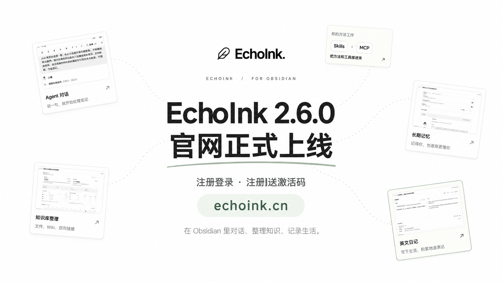

  

<h1 align="center">EchoInk Agent</h1>

你的笔记，有了 AI 搭档。住在 Obsidian 里。

  <a href="https://echoink.cn">官方网站</a> ·
  <a href="https://echoink.cn/install">下载与安装</a> ·
  <a href="#260-更新">2.6.0 更新</a> ·
  <a href="#隐私与数据">隐私与数据</a> ·
  <a href="README.md">English</a>

  
  
  

<a href="https://echoink.cn"><strong>访问官网 echoink.cn</strong></a>

EchoInk 是住在 Obsidian 里的个人知识 Agent。和笔记对话、整理知识、保留可查看和修正的长期记忆，也记录自己的日常。笔记留在你的 Vault，AI 功能连接你自己的模型服务；正常安装无需 Codex CLI。

## 2.6.0 更新

**EchoInk 有官网了：[echoink.cn](https://echoink.cn)。** 产品介绍、下载、使用说明和账号管理，都可以从这里找到。

- **支持注册、登录和 PRO 激活。** 使用邮箱验证码或已有密码登录。目前内测活动为“注册送激活码”：注册并验证邮箱后领取，数量与有效期以活动页面为准。在桌面插件登录后，点击“使用兑换码”即可激活。
- **财务，从记账到安排计划。** 支持微信、支付宝账单导入，商户、账户与分类管理，月度预算、持续目标，以及账单计划和记录关联。连接自己的模型后，可辅助整理账单、生成财务分析。
- **英文日记，写生活，也积累表达。** 直接编辑 Markdown 原稿，生成自然英文，在表达库中搜索和回顾本篇收获；可以选择原文中允许发给模型的部分。
- **更顺手的工作区。** 新增主题颜色、首页分区导航、英文日记快捷入口，以及按年、月筛选的活动热力图。
- **会员状态更清楚。** 兑换时显示联网进度，授权成功后显示 PRO。订阅到期后，已启用的 PRO 插件保留已有资料阅读，开关与新增、导入、修改、生成操作禁用；普通对话、知识库和原始 Markdown 仍可使用。
- **模型与平板适配。** 更新模型发现与 DeepSeek 请求兼容，增加 iPad 宽屏布局和分栏。移动端仍处于 Beta。

财务和英文日记属于 PRO 插件，**PRO 不包含模型调用额度**。目前内测尚未开放付费购买，活动与订阅说明以[官网](https://echoink.cn/plans)为准。

## 下载与说明

前往 [echoink.cn](https://echoink.cn) 查看[安装方法](https://echoink.cn/install)、[功能介绍](https://echoink.cn/features)和[帮助与支持](https://echoink.cn/support)。仓库的 [Releases](https://github.com/AKin-lvyifang/codex-echoink/releases) 继续提供官方插件文件。

需要 **Obsidian 1.11.4 及以上**。上述账号、财务与英文日记功能用于桌面端。移动 Beta 支持对话、Markdown 笔记读取与新建、本地记忆及平板布局；暂不包含桌面会员、财务、英文日记、附件、CLI 和完整 Skills/MCP 能力。iOS 与 Android 真机验证仍未完成。

插件文件超过 Obsidian Sync Standard 的单文件 5 MB 限制。请在各设备上通过官方下载或社区插件分别安装、更新，不要依赖 Sync Standard 传输该文件。

## 隐私与数据

- 对话、笔记、知识、记忆、日记和财务记录保存在本地；插件不会默认上传整个 Vault。
- **https://echoink.cn** 提供注册、登录、邮箱验证、兑换、订阅与设备授权服务，接收完成这些请求所需的账号资料和授权数据，包括生成的设备标识。PRO 插件需要 EchoInk 账号与有效权益；普通对话和知识库无需 EchoInk 账号。
- 桌面端的账号会话和设备授权加密保存在 Vault 外的 **`~/.echoink/membership/`**，避免随笔记同步设备凭据；加密密钥使用 Obsidian 的安全存储。持久安全存储不可用时，仅在当前会话内存中保存授权。
- Provider API Key 与 OpenAI Codex Beta 登录凭据保存在当前 Vault 的插件设置中，请在可信设备和 Vault 中配置。
- 你选择的模型服务会接收当前 AI 请求所需的提示词、笔记、附件、记忆和工具结果。模型服务可能要求独立账号并另行收费；图片输入需要支持视觉的模型。
- 桌面对话可以选择 Vault 外的本地工作区。文件访问遵循所选权限；“完全访问”会解除工作区边界。Vault 外附件仅在你明确选择、拖入或粘贴时读取。
- Tavily 联网搜索默认关闭。开启后，搜索词发送至 `api.tavily.com`，返回的摘要与链接交给当前模型。Tavily 需要单独账号和 Key；连接测试也会执行一次 basic 搜索并消耗 1 credit，详见[官方计费说明](https://docs.tavily.com/documentation/api-credits)。
- 自定义 Provider 与 MCP 会访问你配置的服务或本机命令。插件不采集客户端使用遥测；官网与账号服务的数据处理见[隐私政策](https://echoink.cn/support#privacy)。

## 许可声明

EchoInk 按组件分别授权：基础部分采用标准的 [MIT 开源许可](licenses/MIT.txt)；财务、英文日记、会员与激活服务，以及 [LICENSE](LICENSE) 列明的其他 PRO 文件，采用 [EchoInk PRO 商业许可](licenses/PRO-LICENSE.txt)。整个插件包并非全部采用 MIT，也不能整体称为 OSI 开源软件。两套许可分别约束对应内容，不是对整套产品任选其一。

MIT 基础部分允许修改、再分发和商用。PRO 源码允许个人、非商业阅读与学习；持有有效 PRO 权益的用户，可以正常使用未经修改的官方发行版处理个人事务、工作和企业内部业务，但不得绕过激活，也不因此获得修改、分发 PRO 代码或将其用于其他商业产品的权利。这些用途须另行取得书面授权。订阅或激活码授予的是产品使用权，不是源码转售权。

两部分由同一个官方插件包提供，激活无需再次安装。此前的 MIT 授权和第三方许可继续有效。你的笔记及独立创作的成果，不会仅因使用 EchoInk 而自动受到 PRO 许可约束。完整范围、素材例外与既有权利见 [LICENSE](LICENSE)，第三方材料见 [THIRD_PARTY_NOTICES.md](THIRD_PARTY_NOTICES.md)。
