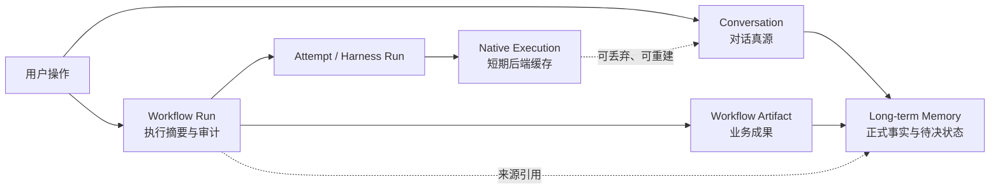

# EchoInk Harness 记录生命周期实施计划

状态：已批准，进入分阶段实施

建立日期：2026-07-18

最后更新：2026-07-20

决策真源：[`ADR 0005`](adrs/0005-record-lifecycle-authority.md)

进度真源：[`harness-record-lifecycle-progress.md`](harness-record-lifecycle-progress.md)

实施记录：[`harness-record-lifecycle-log.md`](harness-record-lifecycle-log.md)

## 结论

EchoInk 必须保存“用户真正拥有的记录”，但不应永久保存每次调用 Agent
产生的全部执行缓存。

目标模型固定为五层：

1. `Conversation`：跨 Codex、OpenCode、Hermes 的对话真源。
2. `Workflow Run`：一次用户操作或自动任务的可审计执行记录。
3. `Native Execution`：后端 thread、session、run 或 process，属于短期执行缓存。
4. `Workflow Artifact`：报告、Wiki、Tracker、WAL、已确认 Editor 候选等业务成果。
5. `Long-term Memory`：正式 active Memory、待确认或待对账状态，以及它们的来源事务。

普通对话可以短期复用原生会话，但连续性只依赖 EchoInk Conversation。结构化
任务与 Editor phase 使用隔离的 Native Execution，先提交 EchoInk 本地结果，
再做异步清理。原生清理失败只进入重试或隔离区，不能把业务成功改判成失败。

这不是“把临时会话改成永久会话”，也不是“继续每轮都删，只多留一份日志”。
它把用户记录、业务记录、诊断记录和后端缓存拆开治理。

## 当前问题与证据

本轮只读审计确认问题不是 Codex 的单点特例，而是统一生命周期事务缺失。

| 现状 | 后果 |
| --- | --- |
| Knowledge `/clear` 只设置 `messagesHiddenBefore` 并删除 legacy `threadId` | 页面看似清空，但 Context Compiler 与 snapshot 仍可能读取旧消息 |
| Workspace 切换只改 `cwd` 和 legacy thread | 新工作区可能继续 resume 旧工作区的 backend binding |
| Lease 过期、超轮次或超上下文后直接覆盖 binding | 旧 native ID 来不及进入耐久 cleanup 台账 |
| Editor 三后端没有完整接入 Native Execution Manager | 成功、失败、取消都可能遗留 thread/session/run |
| Codex prewarm 可在没有用户 Turn 时创建 thread | 产生没有 Harness `runId`、无人回收的原生会话 |
| cleanup 失败无限退避，due 队列直接 FIFO 截断 | 旧失败可能长期阻塞新 cleanup |
| Conversation、History、Run、Raw 与 `data.json` 存在重复正文或所有权 | 删除、保留和恢复可能互相矛盾 |
| 后端原生能力不一致 | Codex 只能 archive，OpenCode 可 delete，Hermes 当前运行路径不能统一承诺 cleanup |

代码锚点：

- `src/knowledge-base/session-history.ts`
- `src/ui/codex-view/session-controller.ts`
- `src/ui/codex-view/workspace-controller.ts`
- `src/harness/kernel/context-compiler.ts`
- `src/harness/kernel/native-session-lease-manager.ts`
- `src/harness/kernel/run-orchestrator.ts`
- `src/harness/conversation/conversation-store.ts`
- `src/harness/native/native-execution-store.ts`
- `src/harness/native/native-execution-manager.ts`
- `src/ui/codex-view/editor-action-runner.ts`

## 目标与不做

### 目标

- Conversation 是唯一对话正文真源；切换后端不丢历史。
- 所有执行都能从用户操作追到 backend-native ID、业务产物和清理结果。
- `/clear` 真正开启新上下文，旧内容不会再次注入模型。
- 结构化任务、Editor 和自动维护统一遵守“本地提交在前，Native cleanup 在后”。
- Run payload 有明确保留期限，恢复证据不会被普通 retention 误删。
- 清空、删除、重置缓存、开启新上下文四个操作有不同且可验证的语义。
- 迁移、Raw GC 和删除都可 dry-run、备份、恢复和审计。

### 不做

- Phase 4 迁移门禁通过前，不批量删除任何真实 Conversation、Run、Raw、
  Codex/OpenCode/Hermes 原生会话或长期 Memory。
- 不放宽 Raw 正文只读、Shadow Vault、精确写入围栏、WAL 和 durable commit。
- 不把精确 thread/session cleanup 扩张为清理 Agent 的全局 native Memory。
- 不为了标识符对称而重命名成熟的维护 `attemptId` 合同。
- 不把本机 `codex-memory` V2 Skill 与 EchoInk 插件内置 Memory V2 混成一个系统。

## 五层权威模型



| 层 | 真源内容 | 默认保留 | 普通清理是否可删 |
| --- | --- | --- | --- |
| Conversation | 用户与 Agent 的可见消息、context、snapshot | Chat 至用户删除；Knowledge 7/30/90/永久，默认 30 天 | 只能按明确的记录操作 |
| Workflow Run | 状态、backend、usage、错误码、Artifact/Attempt 引用 | summary 90 天 | 到期可压缩或删除 |
| Native Execution | thread/session/run/process 引用与 cleanup 状态 | Lease 最多 30 分钟、20 Turn 或 120k context chars；结构化任务结束即清理 | 本地提交后可清理 |
| Workflow Artifact | 报告、Wiki、Tracker、WAL、确认后的 Editor 结果 | 服从 Vault 与业务规则 | 不随会话普通 retention 静默删除 |
| Long-term Memory | confirmed 与自动接受的正式 active Memory，以及 pending confirmation、unresolved、pending journal | 独立治理；未收口事务不参与普通 retention | 必须按状态单独选择 |

Run 的详细 payload——完整 prompt、工具输入输出、diff、绝对路径等——默认保留
30 天。未收口 local commit、WAL、cleanup 或 quarantine 的恢复证据不参与普通
retention。

## 两套 Memory V2 的边界

| 系统 | 路径 | 用途 | 本计划是否管理 |
| --- | --- | --- | --- |
| 本机 `codex-memory` V2 Skill | 项目 `.codex-memory/` 与 `~/.codex/memory-v2/` | 让 Codex 在开发任务间恢复项目进度 | 只作为本项目开发记录工具 |
| EchoInk 插件 Memory V2 | Vault `.echoink/memory/` 与 `src/harness/memory/` | 给插件内 Chat/Knowledge 跨会话、跨后端读取正式记忆 | 属于五层模型的 Long-term Memory |

本机 Skill 的 pilot/Hook 状态不能证明插件 Memory 实现正确；插件 Memory 的
测试和真实 Obsidian 状态也不能替代本机 Skill 的 V2 Doctor。

## 标识符与引用图

成熟标识符保持原义：

```text
conversationId / sessionId
  → contextId
  → messageId / turnId
  → workflowRunId
  → attemptId
  → harness runId
  → nativeExecutionRecordId
  → NativeExecutionRef(backendId, native id, kind, deviceKey, vaultId)
  → artifactId / memory sourceRef
```

- `workflowRunId` 表示一次逻辑任务，可以包含多个后端 attempt。
- `attemptId` 沿用维护 WAL 与 Knowledge 合同。
- `runId` 表示一次 Harness invocation。
- Phase 2 引入专用 `turnId`；迁移前用稳定 message ID 作为 product turn anchor。
- 旧 Run 无法可靠拆分时，暂用
  `workflowRunId = attemptId = legacyRunId`，并标记
  `correlation=legacy-unverified`，不伪造归属。

## Surface 生命周期

| Surface | Native 模式 | Conversation / Context | 结束条件 |
| --- | --- | --- | --- |
| Chat | `leased-conversation` | EchoInk 保存完整 Conversation；短租原生会话只作加速 | Lease 失效后登记 retirement，再异步清理 |
| `knowledge.ask` | `leased-conversation` | 使用 Knowledge Conversation 当前 context | 与 Chat 同一 lease 事务 |
| Editor phase | `ephemeral-run` | 不把原生会话当候选真源 | Run Ledger 提交后精确清理本 phase |
| Knowledge check/maintain/reingest/journal | `ephemeral-run` per attempt | Conversation 只保存用户可见投影 | Artifact/WAL/History 提交后清理 winner 与失败 attempt |
| Review | `ephemeral-run` | 报告是 Artifact | 报告提交后清理 |
| Memory Curator | `ephemeral-run` | 正式 `index.json` 才是真源 | Memory transaction 提交或保留 pending 后清理 |

## Backend 能力合同

| Backend | 当前 native 对象 | Resume | 安全处置 | Phase 目标 |
| --- | --- | --- | --- | --- |
| Codex | provider-persistent thread | native | archive | 所有 thread 先入账；移除无台账 prewarm |
| OpenCode | provider-persistent session | native | delete，not-found 视为幂等完成 | 所有 session 精确关联并有限重试 |
| Hermes | persistence 未可靠证明的 run/session | 当前以 context rehydrate 为主 | 当前 Harness 路径明确 `unsupported` | Phase 3 只在安装版本实证支持时接入 load/resume/delete |

产品文案只能展示真实能力：archive 不能写成 delete，unsupported 不能写成已清理，
context rehydrate 不能写成 native resume。

## 四类用户操作

| 操作 | Conversation | Run / Raw / Memory / Artifact | Native |
| --- | --- | --- | --- |
| 开启新上下文（当前 `/clear`） | 保留历史，关闭旧 context，新建空 context，revision/generation +1 | 不删除 | 旧 lease 全部退休并异步清理 |
| 重置 Agent 缓存 | 历史和当前 context 不变 | 不删除 | 只清 linked lease/native；下轮从 EchoInk bootstrap |
| 清空会话记录 | 保留会话壳，删除消息、snapshot、rolling summary，新建空 context | 关联 payload 按策略删除；共享 Raw 保留；Memory 按下表逐类选择；正式 Artifact 单独选择 | 异步清理，失败不回滚本地删除 |
| 删除会话 | 删除会话壳与索引 | 同上；保留的 Memory/Artifact 通过各自正式事务标 `sourceDeleted` | 异步清理，失败进入 quarantine |

Conversation 清空或删除时，EchoInk Memory V2 必须先按状态生成处置预览：

| Memory 状态 | 默认行为 | 允许的显式选择 | 无法确认状态时 |
| --- | --- | --- | --- |
| confirmed formal active | 保留，并通过 Memory 正式事务标记 `sourceDeleted` | 保留或单独删除 | 阻断 Conversation mutation |
| 自动接受的 formal active（`requiresConfirmation=false`） | 与 confirmed 相同，不能当成临时记录 | 保留或单独删除 | 阻断 Conversation mutation |
| pending confirmation / unresolved | 不静默保留或删除 | 保留并标记 `sourceDeleted`，或明确丢弃 | 阻断 Conversation mutation |
| pending journal | 先 replay、commit 或 abort，把事务收口到可判定状态 | 收口后再按目标状态选择 | 保留恢复证据并阻断 Conversation mutation |

未知 schema、损坏索引、来源关系不完整或 Memory 事务无法落盘时全部 fail closed。
Conversation 删除不能直接编辑 Memory 文件，也不能把 `sourceDeleted` 只写进删除收据。

所有破坏性操作都走 `RecordMutationJournal`，但本地 mutation 与 Native cleanup
使用两个正交状态机：

```text
local mutation: planned → staged → committed | aborted
native cleanup:
  not-required
  awaiting-local-commit → pending → disposing → disposed | unsupported | retained | quarantined
  awaiting-local-commit → aborted
```

提交前按 Conversation generation 做 CAS（比较并交换）；正文先移入可恢复 trash，
不直接永久删除。只有 `local mutation=committed` 才表示清空或删除成功；Native
cleanup record 引用对应的 mutation identity，并且只能在本地提交或恢复对账证明
提交成立后进入 `pending`。
cleanup 重试或进入 `quarantined` 都不能把已提交的业务结果改成失败。用户收据必须
同时显示两套状态，不能用一个 `done/failed` 覆盖二者。

## 上下文轮换事务

Phase 1 新增统一入口：

```text
rotateSessionContext(session, reason, mutation)
```

固定顺序：

1. 对 `start-new-context` / `agent-cache-reset` 先创建并 stage
   `RecordMutationJournal`，冻结 before/target Conversation proof。
2. 为全部旧 backend binding 创建唯一 retirement record，记录
   `recordMutationId`、`targetConversationId`、`targetGeneration` 与
   `targetCommitId`，初态为 `awaiting-local-commit`。
3. 修改 revision、context 边界、workspace、消息投影和 active binding；两类
   非破坏操作不得改写 durable Conversation 记录。
4. 把同一个 `targetGeneration/targetCommitId` 严格提交到 Conversation Store。
5. 在仍持有同一 Conversation authority 时读回 Store，幂等提交或中止 Journal。
6. 只有 Journal committed 且 target exact 时，才把 retirement record 标为
   `pending/due`。
7. 异步 cleanup；失败只进入 retry/quarantine。
8. Conversation 提交失败时回滚内存状态；Journal 无法收口时保留
   `awaiting-local-commit` 供启动恢复，旧原生会话不执行 cleanup。

启动恢复必须先扫描非终态 Journal，再扫描 `awaiting-local-commit` 与
`pending/due`。对每条
`awaiting-local-commit` 记录，以持久化 Conversation 的 generation 和 commit
identity 对账：

- Journal committed，且目标 generation 与 commit identity 已耐久提交时，幂等
  提升为 `pending/due`。
- Journal aborted，且 Conversation 仍是精确 source/before target 时，标记
  `aborted`。
- Conversation 仍处于目标之前，且目标 commit identity 不存在时，标记
  `aborted`，保留旧 Native，不执行 cleanup（只适用于 legacy retirement 或已
  aborted Journal）。
- Conversation 已进入更高 generation、commit identity 缺失、schema 未知或证据
  互相矛盾，或 Journal 非终态/损坏/错绑时，进入 quarantine 并阻断 cleanup，
  不能靠猜测提升或回滚。

状态职责分开：

- `messagesHiddenBefore` 只负责旧 UI 兼容。
- `revision` / `generation` 表示上下文 epoch。
- `contextId` 与 `contextStartsAfterMessageId` 决定模型能读取的内容。
- `workspaceFingerprint = hash(normalizedVaultPath + normalizedCwd)` 防止跨工作区 resume。

旧 binding 没有 fingerprint 时按不匹配处理，安全 bootstrap 一次，不冒险 resume。

## Native cleanup 目标状态

- 所有 cleanup 只通过 `NativeExecutionManager`。
- 自动尝试最多 6 次；第 6 次失败进入 `quarantined`。
- 新 cleanup 与历史 retry 各有固定配额，避免 FIFO 饥饿。
- `cleanupDue()` 单飞；同一 record 同时最多执行一次。
- Editor 等刚完成的任务按 record ID 精确 cleanup，不被全局 backlog 阻塞。
- `disposed`、`unsupported`、`retained`、`quarantined` 是明确终态。
- Run Ledger 事件写入失败只形成审计 warning，不阻止真实 cleanup。
- 启动恢复独立执行 bounded cleanup，不依赖“连接 Codex”或“刚好执行知识任务”。

## Editor 专项

Editor 的每个 phase 都执行：

```text
提前登记 Native ID → 提交 Run Ledger → 停止 adapter → settle → 精确 cleanup
```

- Codex 在 `startThread` 返回后、`startTurn` 前登记。
- OpenCode/Hermes 复用 `onRunId`，成功、失败和取消出口都等待登记。
- `NativeExecutionRef` 作为兜底去重，不覆盖 stale replacement 产生的第二个 ID。
- 登记失败时不提交 Prompt；已创建对象只做一次 best-effort cleanup。
- 删除 Codex Editor prewarm。以后只有真实延迟数据证明收益，才重新设计有所有权、
  TTL、锁和崩溃恢复的短租池。
- `Enter` 确认和 `Esc` 取消只处理候选，不再次触发 Native cleanup。

## Phase 0：只读基线与 dry-run

目标：先知道真实数据有什么、彼此如何关联、哪些只是未知，而不是先定义“孤儿”
再删除。

交付：

- 只读 `record-lifecycle inventory` 服务与开发 CLI。
- 元数据报告：store 版本、数量、字节、时间范围、关联覆盖率、missing/corrupt、
  cleanup backlog、backend capability snapshot。
- 稳定 `snapshotFingerprint`，用于迁移前后对账。
- `finding` taxonomy：`linked`、`unlinked`、`ambiguous`、`missing`、
  `corrupt`、`future-schema`、`cleanup-pending`、`quarantined-candidate`。
- 真实 Vault dry-run 报告；Raw 只检查规范化目录项、路径、类型、size 与 mtime，
  不打开正文文件，不读取字节，也不计算正文内容 hash。

开发命令固定为：

```bash
npm run inventory:storage -- \
  --vault "<REAL_VAULT>" \
  --plugin-dir codex-echoink \
  --output-dir "<REPORT_OUTPUT_DIR>" \
  --native-scope linked \
  --format both
```

`--native-scope` 支持 `none|linked|vault`，默认 `linked`；只有 `vault` 才额外
列出 cwd 匹配 Vault 但没有 EchoInk 精确引用的记录。`--output-dir` 如果落在
被扫描插件目录内必须 fail closed。CLI 只允许在 output dir 原子生成 JSON 和
Markdown，scanner 本身只接受没有写方法的 `ReadOnlyFs`。

模块边界：

- `src/harness/records/storage-inventory-contract.ts`：report schema 与内容安全策略。
- `src/harness/records/storage-inventory.ts`：六类本地 Store 的只读扫描和交叉引用。
- `src/harness/records/native-provider-inventory.ts`：三后端 metadata probe。
- `src/harness/records/storage-inventory-report.ts`：稳定排序、fingerprint 和报告渲染。
- `src/harness/records/storage-inventory-cli.ts`：参数、安全边界和唯一报告写入层。
- `src/tests/harness-v2/storage-inventory.ts`：fixture 与契约测试。

报告必须包含 `schemaVersion`、`reportId`、`snapshotFingerprint`、
`contentPolicy`、各 source 的 `scanned|partial|unsupported|unavailable|error`、
relations、findings、migration preview 和以下安全收据：

`snapshotFingerprint` 是结构指纹，只由稳定排序后的目录项、规范化相对路径、
文件类型、size、mtime、Store schema version、record metadata 与引用关系生成。
它不包含 Raw 正文字节或正文内容 hash，也不能被解释成内容完整性证明。

```text
readOnly=true
actionsApplied=0
deletionsApplied=0
writesOutsideOutputDir=0
rawBodiesRead=false
```

Finding 固定覆盖 Conversation/data 分叉、index/目录/计数漂移、坏 JSONL、
History 日索引漂移、重复 message ID、missing/unreferenced Raw、Run sequence/
terminal/local-commit 缺口、Native index/event 分叉、重试耗尽、provider
unavailable 与未归属候选。每条 finding 都带
`automaticActionAllowed=false`。

硬边界：

- 零写入、零 rename、零删除、零 backend cleanup。
- 后端探测失败降级为 `partial`，不能把本地 inventory 判失败。
- 未关联的 native ID 只能叫“待归属候选”，不能叫“可删除孤儿”。
- 任一 future schema、解析失败或路径越界都在报告中显式阻断后续 migration。

11 类契约测试覆盖：可见/持久会话分叉，Conversation index 漂移，坏
JSON/JSONL，History 日索引漂移，Raw 引用图，Run Ledger 完整性，Native
index/event replay，Provider 所有权边界，正文与敏感字段零泄漏，只读路径与
symlink 安全，以及确定性 fingerprint/CLI 退出码。

退出标准：上述 fixture 覆盖三后端、各 Store 缺失/损坏/乱序/重复和真实 Vault
metadata-only dry-run；相同结构输入产生相同 fingerprint，运行前后插件数据目录的
目录项、规范化路径、文件类型、size、mtime 与结构指纹不变。验收不读取 Raw
正文字节，也不计算正文内容 hash。

## Phase 1：上下文与 Native 生命周期

实施顺序：

1. 增加 context 边界、workspace fingerprint 和 binding retirement record。
2. 把 `/clear`、History restore、Workspace switch、Reset Agent cache、Lease rollover
   收口到统一事务。
3. 移除 Codex prewarm；Editor 接入早期 ID 捕获和精确结算。
4. Native cleanup 增加 6 次上限、quarantine、公平队列和 single-flight。
5. 启动恢复统一扫描 `awaiting-local-commit` 与 pending retirement/cleanup，并按
   target generation/commit identity 对账。

阻断性验收：

- `/clear` 后重启 Obsidian，旧口令仍不会进入模型上下文。
- Workspace A 切到 B 后，A 的原生会话不会在 B resume。
- Conversation commit 失败时，revision、context、binding 全部回滚且 cleanup 为零。
- 在 Conversation commit 与 retirement 晋级之间注入崩溃后，启动恢复能按
  target generation/commit identity 唯一决定提升 `pending/due` 或
  `aborted`；证据矛盾时 quarantine，cleanup 为零。
- rollover 在覆盖 binding 前已耐久登记旧 native ref。
- 两个入口并发 cleanup 时，同一 native ID 最多收到一次处置。
- 20 条旧失败存在时，本轮新 cleanup 仍获得执行名额。

## Phase 2：统一本地记录与数据治理

### Conversation V2

- `Conversation` 只保存产品状态；每条消息绑定 `contextId`，可选绑定
  `turnId/workflowRunId/attemptId`。
- backend binding 移出 Conversation，归 Native Execution/Lease。
- snapshot 与 rolling summary 只覆盖当前 context。
- `data.json` 只保存设置、会话壳和当前选择，不保存完整 messages。

### Run summary / payload

- `WorkflowRunSummary` 保存逻辑任务、surface、workflow、状态、usage、Artifact 和
  attempt 引用。
- `AttemptRunSummary` 保存 backend、native ref、local commit、cleanup 与有限错误码。
- 完整 HarnessEvent JSONL 按 attempt 保存为短期 payload。
- 过期状态区分 `expired`、`missing`、`corrupt`，不把已过期写成从未存在。
- 清理 Run payload 时同步更新 Memory archive catalog 与 README/测试口径。

### Knowledge History 投影

- 日索引只保存 Conversation message、Workflow Run 或 Artifact 的引用和计数。
- 不复制 `text/rawRef/backendBindings`。
- 缺失或损坏时可从权威 Store 重建。
- “删除知识库记录”与“重建历史索引”是两个产品操作。

### Raw 引用图与 GC

- 合法 owner 只有 canonical Conversation message、仍保留的 Run payload、
  显式声明的 Memory/Artifact。
- Knowledge History 不拥有 Raw。
- 完整 mark 后再次校验所有 Store generation；变化则整轮停止。
- orphan 先移入 `.trash/raw/<gcRunId>`，至少 7 天并经过第二次稳定全扫后才永久删除。
- unknown schema、解析失败、symlink/realpath 越界、hash 变化全部 fail closed。

### 删除事务与迁移

- 四类用户操作统一走 mutation journal 与可恢复 trash。
- 所有可变或可删除目录先进入 Root Registry。`rootId` 只是逻辑名称，只有同时
  匹配 registry、canonical path、owner boundary、目录 identity 和 binding digest
  才构成物理 root 权限；目录重建、换绑、symlink 或越界全部阻断。
- destructive intent、trash receipt 和 recovery evidence 必须冻结同一组 Root
  Binding 引用。Trash finalize 只能在全局 mutation authority 已取得、Journal
  已耐久授权且 Root Binding 再验证通过后发生。
- Intent 同时冻结变更前 Conversation 的 generation、commit ID、content revision，
  以及目标 Conversation identity 或删除 tombstone。Recovery 只能根据 Store
  readback 与这些 frozen target 做比较，调用方不能直接提交 `exact-target` 判断。
- 清空记录的 target 使用新的空 payload/context；提交时不保留
  `previousPayloadKey`，也不对全部旧 payload 执行普通 GC。删除会话的 target
  使用 Conversation Store 外置的 deletion tombstone；tombstone 提交后旧 session
  目录仍留作 Trash source。两种 writer 都必须先冻结 source plan，plan 漂移时在
  target commit 前失败。
- coordinator 先建立可恢复 Trash 并写入 `trash-staged`，再在破坏性 effect 前
  回读 Registry 与物理目录。退休完成后才写 `source-retired`；恢复必须先写
  `compensation-prepared`，restore 成功后才能写 `trash-restored`。source/trash
  root 不得相同或互相嵌套。
- Production recovery runner 负责收集 Conversation 与 Trash 证据，再决定
  roll-forward、compensate 或 blocked。Memory/Artifact 等 participant 只有在
  对应正式事务 adapter 能证明 forward/restore 后才允许写 Journal step。
- Production wiring 必须向 Runner 提供产品写入所用的同一 Conversation mutation
  authority。Runner 整轮持有它，并在 effect 前和 Journal 终态发布前重复
  readback；证据变化时保留 staged/compensating 状态并显式阻断，不能用旧
  observation 收口。
- 破坏性 participant 构造前必须先生成一份 Conversation 级统一 inventory。
  Run inventory 从全部正式 head/manifest 反查 Workflow、Attempt、payload 与显式
  Raw owner；Memory 和 Artifact 只允许走“不初始化、不迁移、不修复”的 existing
  Store reader；Raw owner graph 必须同时包含全部 Conversation 与全部 Run payload
  owner。各 Store 在扫描开始和结束时的稳定快照必须一致，否则本轮选择整体失效。
- Memory pending journal、未收口或 durable-pending transaction、missing Raw、
  未知 entry/chain、漏挂 Attempt/payload 都是 blocker。pending confirmation 和
  正式 Artifact 必须经过显式 retain 选择后，才能生成
  `mark-source-deleted` participant；shared Raw 只能 retain，只有 exclusive Raw
  才能生成 discard participant。
- 每个破坏性 Journal 必须在第一个 stage 前发布独立、不可变的 execution plan。
  plan 绑定 mutation、intent digest 与完整有序 participant；Trash participant
  只保存 source/trash root ID 和规范化相对路径，Run/Memory/Artifact participant
  保存正式 subject ID 以及 Run payload identity、Memory 状态或 Artifact kind，
  不保存本机绝对路径。
  重启时只能从正式 production root catalog 重建物理路径和 adapter；plan 缺失、
  损坏、晚建、Root 错绑或 subject 错绑时，在 Trash prepare 和 Store effect 前
  阻断。Conversation source 还必须按 operation 绑定目标会话：delete 只能选择该
  session 目录，clear 只能选择该 session 的 payload generation 或旧 payload 文件。
- Journal 的 32 个 participant 上限约束逻辑执行组，不等于一轮会话最多只能关联
  32 条记录。长会话按 record kind、action 与 frozen Root 确定性生成 bundle；
  bundle ID 必须绑定完整、有序的叶子记录集合。每个叶子仍保留独立可检查的
  Store/Trash receipt，只有全部叶子完成同一阶段后才写 aggregate Journal step。
  同一份 inventory 生成的 bundle 必须共用 selection digest；同一组
  record kind、action 与 Root 只能出现一次，不能拆组绕过容量上限。retain bundle
  也要冻结 Root 和结构化的 Run/Raw subject，包括 record digest、相对路径与 Raw
  owner proof；Run payload 的 source-deletion 与 Trash 叶子集合必须完全一致。
  bundle 超过 execution plan 大小或条目上限时必须在 Journal 创建或首个 stage 前
  整体阻断，不能截断，也不能把一次用户删除拆成多个可独立提交的业务 mutation。
  单纯调大 participant、step 或 revision 常量不是方案，因为 append-only Journal
  每个 revision 都会重复 immutable intent，完整补偿也会突破 step/revision 预算。
- 含 retain bundle 的完整计划必须在首次 Trash prepare 前连续重建两次 unified
  inventory，并用冻结的处置选择重新编译 intent、participant、selection digest
  与 runtime Root 集合。完全一致后，runtime 才能为每个 retain bundle 依次发布
  确定性 `prepared` proof；全部 retain proof 必须先于第一条 `trash-staged`。
  proof 发布前还要重新验证对应物理 Root Binding。已有完整且匹配的 proof 可在
  tombstone 已提交、目标 Conversation 不再可枚举时幂等复用；proof 缺失、伪造、
  Root 漂移，或 Trash 已 stage 但 retain proof 不完整时全部 fail closed。
- Trash prepare 与 source retirement 是两个正式 coordinator 操作。prepare
  只建立独立可恢复副本并写 `trash-staged`，源数据保持原位；live 删除必须先
  prepare，再提交 Conversation target。重启可按 execution plan 幂等补齐
  prepare，只有 exact target recovery 才允许后续 retirement。
- `mark-source-deleted` adapter 必须与 intent 中的 Run/Memory/Artifact 逻辑
  participant 完整同序。Bundle adapter 可以包含多个冻结 subject，但 aggregate
  receipt 必须以全部叶子 receipt 的稳定 readback 为前提。Adapter 只先取得各自
  Store mutation lane；随后验证 frozen Root Binding、恢复既有 Store、再次验证
  Root，最后才能 inspect/effect。正式 Store 缺失时不得靠初始化空 Store 继续。
- Memory formal index 保存稳定排序且只增不减的 `sourceConversationIds`，并通过
  正式 Memory transaction 追加 `sourceDeletions`。恢复不删除历史 marker，而是
  在同一 marker 上补齐 restoring transaction proof；旧记录缺少目标 lineage 时
  阻断。
- Workflow Artifact 使用独立 append-only lifecycle chain。首 revision 冻结
  artifact identity、kind 与 Conversation lineage；后续只追加 source-deleted /
  source-restored revision。注册冲突、未注册、chain 损坏或 lineage 不完整全部
  fail closed。
- Roll-forward 固定先标 Run/Memory/Artifact，再退休 Trash；compensate 先补齐
  已落盘但 Journal 丢失的 forward proof，再恢复 Trash，最后恢复
  Run/Memory/Artifact。
  Store effect、readback 与 `participant-staged/restored` Journal step 位于同一
  Store lane；terminal noop 也必须重新验证 Store receipt。
- V1 与 V2 side-by-side；第一次迁移不顺手执行 30/90 天 retention。
- 同 message ID 不同正文进入 conflict/quarantine，不按 mtime 覆盖。
- V2 全量校验后原子切 active manifest；V1 至少保留两个成功启动或一个版本周期。
- V2 已产生新写入后，回滚必须使用 V2 → V1 exporter，不能直接切旧目录。

退出标准：contract 与 crash injection 通过；真实 Vault dry-run 无未解释丢失；
完整备份和回滚演练成功；未经单独确认不清现有历史。

## Phase 3：Backend 原生能力

- Codex：统一 Chat/Editor/Knowledge thread 登记、resume 校验与 archive receipt。
- OpenCode：统一 session resume/delete、not-found 幂等和 device/vault 边界。
- Hermes：探测安装版本真实提供的 session list/load/resume/delete 能力。
  - 能力存在且测试通过：接入 Adapter capability。
  - 能力缺失或输出不稳定：保持 context-rehydrated mode 和 cleanup unsupported。
- 所有能力都由 runtime capability snapshot 驱动，禁止按 backend 名称猜测。

退出标准：自动测试与少量真实 backend 代表场景对齐；产品 UI 不夸大 capability。

## Phase 4：迁移、发布与真实验收

固定顺序：

1. 对主 Vault 与 testing Vault 建立时间戳备份，并在副本上完成一次恢复演练。
2. 运行 Phase 0 dry-run，记录 snapshot fingerprint 与各 Store generation。
3. 进入迁移静默窗口：阻止新 Run、消息追加、Memory commit、retention 和 cleanup
   mutation，等待所有已启动事务到达可恢复终态。
4. 取得全局 mutation lock，重新核对 fingerprint、generation、active WAL 和
   cleanup authority；任一漂移都退出静默窗口并重新 dry-run。
5. 在锁内 side-by-side 迁移、全量验证，并以原子 active-manifest cutover 切换
   reader；旧 V1 仍保留为恢复来源。
6. 释放锁和静默窗口后重复启动两次，验证幂等、active pointer 和新写入。
7. 在 testing Vault 运行 crash/recovery、retention preview、clear/delete preview
   以及 V2 → V1 reverse export/restore 演练。
8. 取得用户确认后才允许执行真实清理。
9. 干净 `main` 持部署锁，运行 test、typecheck、deploy 与 SHA-256 对账。
10. 重载 Obsidian，在 `testing/` 依次验收 Codex、OpenCode、Hermes。

真实 Obsidian 必测：

- Chat 五轮连续对话、切 backend、切 workspace、新上下文和重启。
- Knowledge `/clear` 后旧口令不复活，History 浏览与“设为当前上下文”语义正确。
- Editor 改写/扩写/续写的候选、`Enter`、`Esc`、Markdown 保留和零旧后台污染。
- `/maintain` 仍遵守 selected-first、Shadow Vault、WAL、partial commit 与 Raw 不变。
- Settings 能解释 Conversation、Run payload、Native cache、Memory/Artifact 各自占用与操作范围。
- cleanup 失败显示隔离状态但不把业务成功改红。

## 测试策略

每个行为先写 WHEN/THEN fixture，再改生产代码。至少覆盖：

- 主路径、保存失败、取消、重载、并发、重复恢复。
- old/future schema、损坏 JSON/JSONL、missing Raw、路径越界。
- cleanup 六次失败、single-flight、公平队列、not-found 幂等。
- 30/90 天边界、永久保留、未收口恢复证据保护。
- V1 真实 fixture、歧义关联、conflict、dry-run 零写入、reverse export。
- 三后端 capability 与产品 copy 一致。

阶段门禁：

```text
npm run typecheck
npm run test
npm run build
npm run check:public
git diff --check
```

真实部署只在多分支集成后的干净 `main` 执行，并持有
`/private/tmp/codex-echoink-obsidian-deploy.lock` 到本轮验收结束。

## 实施约束与风险

- 当前本机 `codex-memory` V2 Hook 按线程 `cwd` 路由，不会按 Git
  `common-dir` 自动识别 `/private/tmp` worktree。本任务线程继续绑定主仓库根；
  只从主根运行 `memoryctl.py`，绝不从 worktree 重复迁移。
- 所有仓库改动只在 `codex/harness-record-lifecycle` worktree 完成；不暂存
  `.codex-memory` 和 `node_modules` 软链接。
- 所有 Store 不能由一个巨型类包办。Conversation、Ledger、Native、Memory
  保持领域所有权，只在 `src/harness/lifecycle/` 放跨 Store mutation/迁移协调。
- Retention 改动会改变“完整本地使用档案可搜索”的既有产品承诺，必须同步
  Archive Catalog、README、中英文 copy 和自动测试。
- Phase 0–3 只允许 preview 和 side-by-side 写入测试夹具；真实历史清理是
  Phase 4 的独立确认动作。

## Definition of Done

- ADR、主计划、进度页、实施日志和代码合同一致。
- 五层记录均有明确真源、retention、引用和删除语义。
- `/clear`、重置缓存、清空记录、删除会话四个行为自动化与真实 UI 均可区分。
- 每个 Native Execution 可追到 Conversation/Run/Artifact，或明确标记为
  `unlinked/ambiguous`，没有静默覆盖。
- local commit 永远先于 cleanup；cleanup 最多 6 次且不会饿死新任务。
- 迁移、retention、Raw GC 和删除都有 dry-run、备份、journal、恢复和审计。
- Codex/OpenCode/Hermes 的 UI copy 与实际 capability 一致。
- 全部门禁通过，部署产物哈希一致，真实 Obsidian 代表场景通过。
- 未经用户单独确认，没有批量删除真实历史数据。
